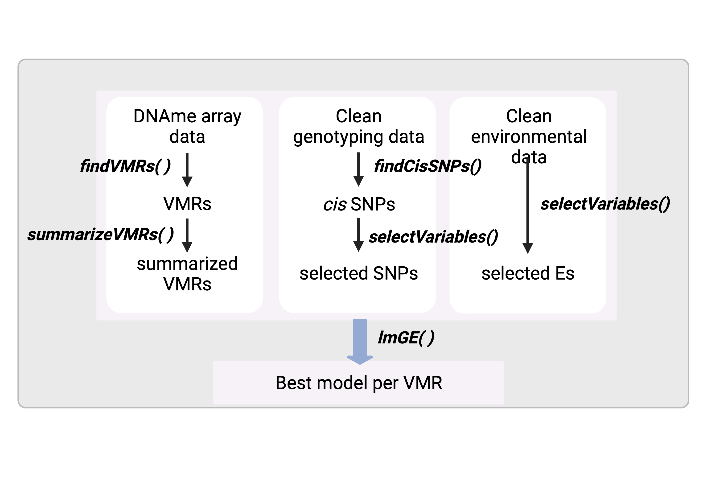

<!-- README.md is generated from README.Rmd. Please edit that file -->

```{r, include = FALSE}
knitr::opts_chunk$set(
  collapse = TRUE,
  comment = "#>",
  fig.path = "man/figures/README-",
  out.width = "100%"
)
```

# RAMEN <a href="https://github.com/ErickNavarroD/RAMEN"></a>

<!-- badges: start -->

<!-- badges: end -->

## Introduction

Regional Association of Methylation variability with genotype and ENvironment (RAMEN) is an R package whose goal is to identify Variable Methylated Regions (VMRs) in microarray DNA methylation data. Additionally, using Genotype (G) and Environmental (E) data, it can identify which G, E, G + E or GxE model better explains this variability.

## Installation

You can install the development version of RAMEN from [GitHub](https://github.com/) with:

``` r
# install.packages("devtools")
devtools::install_github("ErickNavarroD/RAMEN")
```

## Core functions

RAMEN consists of five main functions:

-   `findVMRs()` identifies Variable Methylated Regions (VMRs) in microarrays
-   `summarizeVMRs()`summarizes the regional methylation state of each VMR
-   `findCisSNPs()` identifies the SNPs in *cis* of each VMR
-   `selectVariables()` conducts a LASSO-based variable selection strategy to identify potentially relevant *cis* SNPs and environmental variables
-   `lmGE()` fits linear single-variable genetic (G) and environmental (E), and pairwise additive (G+E) and interaction (GxE) linear models and select the best explanatory model per VMR.

Altogether, these functions create a pipeline that takes a set of individuals with genotype, environmental exposure and DNA methylation information, and generates an estimation of the contribution of the genotype and environment to its DNA methylation variability.

{width="50%"}

## Usage

This is a basic example which shows you how to solve a common problem:

```{r example}
library(RAMEN)
## Vignette in progress
```

## Variations to the standard workflow

## How to get help for RAMEN

If you have any question about RAMEN usage, please post an issue in this github repository so that future users also benefit from the feedback. As an alternative option, you can contact Erick Navarro-Delgado at [erick.navarrodelgado\@bcchr.ca](mailto:erick.navarrodelgado@bcchr.ca){.email}.

## Acknowledgments

I want to thank Dr. Keegan Korthauer and Dr. Michael Kobor for their supervision, feedback and support throughout the development of this package. Also, I want to thank the members of the Kobor and Korthauer lab for their comments and discussion.

The RAMEN package logo was created by Carlos Cortés-Quiñones and Dorothy Lin. Carlos created the drawing, and Dorothy refined the logo and did the lettering.

## Funding

This work was supported by the University of British Columbia, the BC Children's Hospital Research Institute and the Social Exposome Cluster.

## Citing RAMEN

The manuscript detailing RAMEN and its use is currently under preparation. For more information about this please contact Erick I. Navarro-Delgado at [erick.navarrodelgado\@bcchr.ca](mailto:erick.navarrodelgado@bcchr.ca){.email}.

## Licence

GPL (\>= 3)
