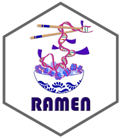
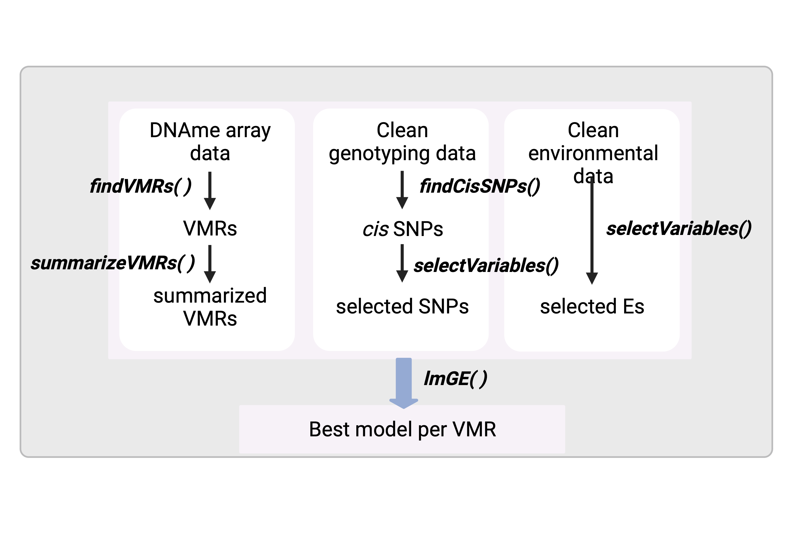

<!-- README.md is generated from README.Rmd. Please edit that file -->

```{r, include = FALSE}
knitr::opts_chunk$set(
  collapse = TRUE,
  comment = "#>",
  fig.path = "man/figures/README-",
  out.width = "100%"
)
```

# RAMEN <a href="https://github.com/ErickNavarroD/RAMEN"></a>

<!-- badges: start -->
[](https://www.repostatus.org/#active)
[](https://zenodo.org/badge/latestdoi/585986641)
[](https://lifecycle.r-lib.org/articles/stages.html#stable)
[](https://app.codecov.io/gh/ErickNavarroD/RAMEN)
[](https://github.com/ErickNavarroD/RAMEN/actions/workflows/R-CMD-check.yaml)
[](https://github.com/ropensci/software-review/issues/743)
<!-- badges: end -->

## Overview

Regional Association of Methylome variability with the Exposome and geNome 
(RAMEN) is an R package which goal is to estimate the contribution of genetic 
variants and environmental exposures to DNA methylation variability at a 
genome-wide scale. RAMEN takes advantage of the fact that DNA methylation levels
at nearby CpG sites are often correlated, and uses this information to identify 
Variable Methylated Loci (VML) from microarray DNA methylation data. Then, using
genomic and exposomic data, it can identify which model out of the following 
explains best the DNA methylation variability at each VML: genetic (G), 
environmental (E), additive (G+E) or interactive (GxE).

RAMEN provides a Findable, Accesible, Interoperable and Reusable (FAIR) workflow
to conduct gene-environment contribution analyses to high-dimensional DNA 
methylome data (described in 
[Navarro-Delgado et al. (2025)](https://doi.org/10.1186/s13059-025-03864-4). 
Using a blend of traditional statistical methods and machine learning 
approaches, RAMEN is designed to be computationally efficient and user-friendly,
allowing researchers to gain insights into the complex interplay between 
genetics, environment and DNA methylation variability. The package includes a 
detailed tutorial, and individual functions that could be useful for other 
applications beyond the gene-environment contribution analysis.

## Installation

You can install the latest version of RAMEN from 
[GitHub](https://github.com/) with:

``` r
# install.packages("devtools")
# install.packages("BiocManager")
# BiocManager::install("S4Vectors")
# BiocManager::install("IRanges")
# BiocManager::install("GenomicRanges")

devtools::install_github("ErickNavarroD/RAMEN")
```

## Usage

For a detailed tutorial on how to use RAMEN, please check the package's vignette
or [website](https://ericknavarrod.github.io/RAMEN/articles/RAMEN.html). 
Altogether, RAMEN provides a workflow that takes a set of individuals 
with genome, exposome and DNA methylome information, and generates an estimation
of the contribution of genetic variants and environmental exposures to its DNA 
methylation variability. Functions that conduct computationally intensive tasks
are compatible with parallel computing. 



In brief, the standard workflow consists of the following steps:

1.  Identify Variable Methylated Loci (VML) with `findVML()`.

```{r}
library(RAMEN)
library(dplyr)
library(ggplot2)

VML <- RAMEN::findVML(
  methylation_data = RAMEN::test_methylation_data,
  array_manifest = "IlluminaHumanMethylationEPICv1",
  cor_threshold = 0,
  var_method = "variance",
  var_distribution = "ultrastable",
  var_threshold_percentile = 0.99,
  max_distance = 1000
)

head(VML$VML) # Take a look at the identified VML data frame
```

2.  Summarize the regional methylation state of each VML with `summarizeVML()`.

```{r}
summarized_methyl_VML <- RAMEN::summarizeVML(
  VML_df = VML$VML,
  methylation_data = test_methylation_data
)

# Look at the resulting object
summarized_methyl_VML[1:5, 1:5]
```

3.  Identify the SNPs in *cis* of each VML with `findCisSNPs()`.

```{r}
VML_cis_snps <- RAMEN::findCisSNPs(
  VML_df = VML$VML,
  genotype_information = RAMEN::test_genotype_information,
  distance = 1e+06
)

# Take a look at the result
head(VML_cis_snps)
```

4.  Conduct a LASSO-based feature selection strategy to identify potentially 
relevant *cis* SNPs and environmental variables with `selectVariables()`.

```{r}
selected_variables <- RAMEN::selectVariables(
  VML_df = VML_cis_snps,
  genotype_matrix = RAMEN::test_genotype_matrix,
  environmental_matrix = RAMEN::test_environmental_matrix,
  covariates = RAMEN::test_covariates,
  summarized_methyl_VML = summarized_methyl_VML,
  seed = 1
)

head(selected_variables)
```

5.  Fit linear single-variable genetic (G), environmental (E), pairwise additive
(G+E) and pairwise interaction (GxE) linear models, and select the best 
explanatory model for each VML with `lmGE()`.

```{r}
lmge_res <- RAMEN::lmGE(
  selected_variables = selected_variables,
  summarized_methyl_VML = summarized_methyl_VML,
  genotype_matrix = RAMEN::test_genotype_matrix,
  environmental_matrix = RAMEN::test_environmental_matrix,
  covariates = RAMEN::test_covariates,
  model_selection = "AIC"
)

# Check the output
head(lmge_res)
```

6.  Simulate a null distribution of G and E effects on DNAme variability with 
`nullDistGE()`, and use it to filter out poor-performing best explanatory models
selected by *lmGE()*.

```{r}
null_dist <- RAMEN::nullDistGE(
  VML_df = VML_cis_snps,
  genotype_matrix = RAMEN::test_genotype_matrix,
  environmental_matrix = RAMEN::test_environmental_matrix,
  summarized_methyl_VML = summarized_methyl_VML,
  permutations = 1,
  covariates = RAMEN::test_covariates,
  seed = 1,
  model_selection = "AIC"
)

# Set threshold
cutoff_single <- quantile(
  null_dist %>%
    filter(model_group %in% c("G", "E")) %>%
    pull(R2_difference),
  0.95
)
cutoff_joint <- quantile(
  null_dist %>%
    filter(model_group %in% c("G+E", "GxE")) %>%
    pull(R2_difference),
  0.95
)

# Get a data frame with the final results
final_res <- lmge_res %>%
  dplyr::mutate(
    r2_difference_basal = tot_r_squared - basal_rsquared,
    # Label if the best explanatory model passes its corresponding threshold
    pass_cutoff_threshold = case_when(
      model_group %in% c("G", "E") ~ r2_difference_basal > cutoff_single,
      model_group %in% c("G+E", "GxE") ~ r2_difference_basal > cutoff_joint
    ),
    # Label the final model group, replacing bad performing winning models with
    #  "B" (basal)
    model_group = case_when(
      pass_cutoff_threshold ~ model_group,
      TRUE ~ "B"
    )
  ) %>%
  dplyr::select(-pass_cutoff_threshold) # Drop temporary column

# Keep only VML that have informative models with out data
filtered_res <- final_res %>%
  dplyr::filter(!model_group == "B") # Filter based on the cutoff threshold

final_res %>%
  dplyr::group_by(model_group) %>%
  dplyr::summarise(count = n()) %>%
  ggplot2::ggplot(aes(x = model_group, y = count)) +
  ggplot2::geom_col() +
  ggplot2::xlab("Best explanatory model") +
  ggplot2::ylab("VML") +
  ggplot2::theme_classic()
```

## Variations to the standard workflow

Besides using RAMEN for a gene-environment contribution analysis, the package 
provides individual functions that could help users in other tasks, such as: 

  -   Reduction of multiple hypothesis test burden in EWAS or differential 
  methylation analysis by using VML instead of individual probes.
  -   Fit additive and interaction models given a set of variables of interest 
  and select the best explanatory model for DNAme data (e.g. epistasis or 
  ExE studies). 
  -   Quickly identify SNPs in *cis* of CpG probes.
  -   Get the median correlation of probes in custom regions of interest with 
  `medCorVMR()`.

## How to get help for RAMEN

If you have any question about RAMEN usage, please [post a new issue](https://github.com/ErickNavarroD/RAMEN/issues/new/choose) in this github 
repository so that future users also benefit from the discussion.

## Acknowledgments

This package was developed by Erick I. Navarro-Delgado under the supervision of 
Dr. Keegan Korthauer and Dr. Michael S. Kobor. We want to thank the members of 
the Kobor and Korthauer lab for their feeback during the development of RAMEN. 
Additionally, we want to thank Carlos Cortés-Quiñones and Dorothy Lin for 
helping create the package logo. Erick conceptualized the logo, Carlos drew it, 
and Dorothy refined it and finished the lettering.

## Funding

This work was supported by the University of British Columbia, the BC Children's
Hospital Research Institute and the Social Exposome Cluster.

## Citing RAMEN

If you use RAMEN for any of your analyses, please cite the following publication:

  -   Navarro-Delgado, E.I., Czamara, D., Edwards, K. et al. RAMEN: Dissecting 
  individual, additive and interactive gene-environment contributions to DNA 
  methylome variability in cord blood. *Genome Biol* 26, 421 (2025). 
  https://doi.org/10.1186/s13059-025-03864-4 

## Code of conduct
Please note that this package is released with a [Contributor
Code of Conduct](https://ropensci.org/code-of-conduct/). 
By contributing to this project, you agree to abide by its terms.

## Licence

GPL (\>= 3)
