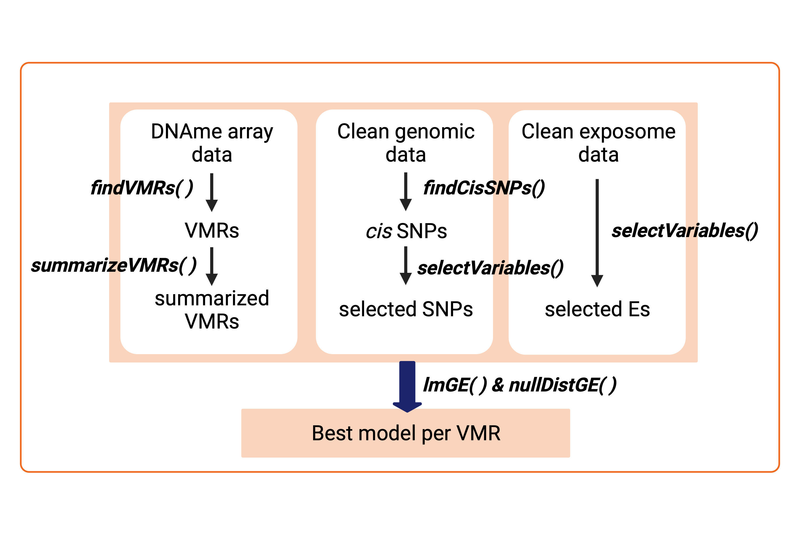

<!-- README.md is generated from README.Rmd. Please edit that file -->

# RAMEN <a href="https://github.com/ErickNavarroD/RAMEN"></a>

<!-- badges: start -->
<!-- badges: end -->

## Overview

Regional Association of Methylome variability with the Exposome and
geNome (RAMEN) is an R package whose goal is to identify Variable
Methylated Regions (VMRs) in microarray DNA methylation data.
Additionally, using Genotype (G) and Environmental (E) data, it can
identify which G, E, G+E or GxE model better explains this variability.

## Installation

You can install the development version of RAMEN from
[GitHub](https://github.com/) with:

``` r
# install.packages("devtools")
devtools::install_github("ErickNavarroD/RAMEN")
```

## Core functions

RAMEN consists of six main functions:

- `findVMRs()` identifies Variable Methylated Regions (VMRs) in
  microarrays
- `summarizeVMRs()`summarizes the regional methylation state of each VMR
- `findCisSNPs()` identifies the SNPs in *cis* of each VMR
- `selectVariables()` conducts a LASSO-based variable selection strategy
  to identify potentially relevant *cis* SNPs and environmental
  variables
- `lmGE()` fits linear single-variable genetic (G) and environmental
  (E), and pairwise additive (G+E) and interaction (GxE) linear models
  and select the best explanatory model per VMR.
- `nullDistGE()` simulates a delta R squared null distribution of G and
  E effects on DNAme variability. Useful for filtering out
  poor-performing best explanatory models selected by *lmGE()*.

Altogether, these functions create a pipeline that takes a set of
individuals with genotype, environmental exposure and DNA methylation
information, and generates an estimation of the contribution of the
genotype and environment to its DNA methylation variability. Functions
that conduct computationally intensive tasks are compatible with
parallel computing.



## Usage

The creation of a package vignette is currently in progress. However,
the documentation of the functions is already completed and provide
detailed information about their use.

``` r
library(RAMEN)
## Vignette in progress
```

## Variations to the standard workflow

Besides using RAMEN for completing the analysis mentioned above, the
package provides individual functions that could help users in other
tasks, such as:

- Reduction of tests prior to an EWAS or differential methylation
  analysis (i.e., conducting the analyses on identified VMRs to reduce
  redundant tests by grouping nearby correlated CpGs and to avoid tests
  in non-variant regions)
- Fit additive and interaction models given a set of variables of
  interest and select the best explanatory model for DNAme data.
- Quickly identify SNPs in *cis* of CpG probes for variable reduction
  during mQTL analyses.
- Get the median correlation of probes in regions of interest (with
  `medCorVMR()`).

## How to get help for RAMEN

If you have any question about RAMEN usage, please post an issue in this
github repository so that future users also benefit from the discussion
As an alternative option, you can contact Erick Navarro-Delgado at
<erick.navarrodelgado@bcchr.ca>.

## Acknowledgments

I want to thank Dr. Keegan Korthauer and Dr. Michael S. Kobor for their
supervision, feedback and support throughout the development of this
package. Also, I want to thank the members of the Kobor and Korthauer
lab for their comments and discussion.

The RAMEN package logo was created by Carlos Cortés-Quiñones and Dorothy
Lin. Carlos created the drawing, and Dorothy refined the logo and did
the lettering.

## Funding

This work was supported by the University of British Columbia, the BC
Children’s Hospital Research Institute and the Social Exposome Cluster.

## Citing RAMEN

The manuscript detailing RAMEN and its use is currently under
preparation. For more information about this please contact Erick I.
Navarro-Delgado at <erick.navarrodelgado@bcchr.ca>.

## Licence

GPL (\>= 3)
