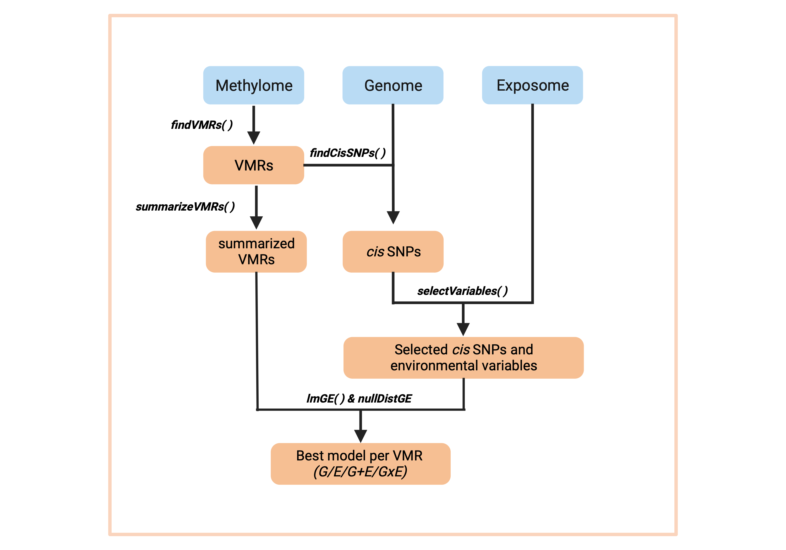
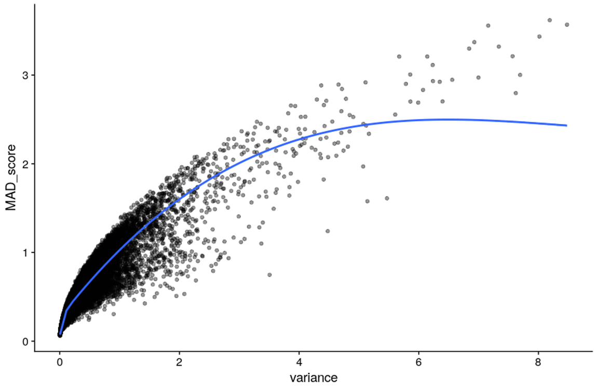
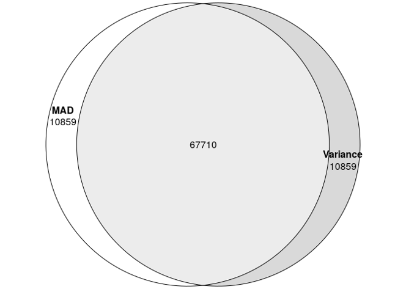
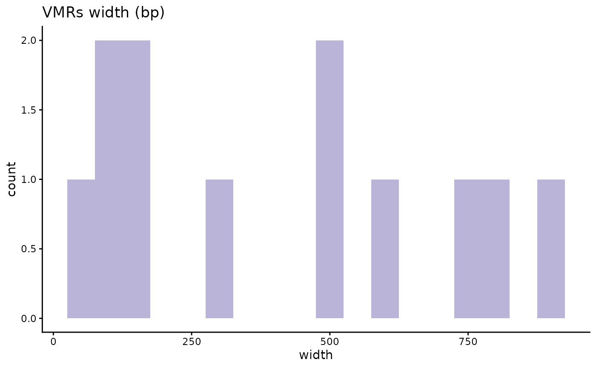

# RAMEN

## Introduction

**Regional Association of Methylome variability with the Exposome and
geNome** **(RAMEN)** is an R package which goal is to estimate the
contribution of genetic variants and environmental exposures to loci
with high DNA methylation (DNAme) variability at a genome-wide scale
using population data. Characterizing the factors that contribute to
DNAme variability is important because DNAme is a key epigenetic
mechanism that regulates gene expression and plays an important role in
development, disease, and environmental adaptation.

RAMEN provides a Findable, Accesible, Interoperable and Reusable (FAIR)
workflow to conduct gene-environment contribution analyses to
high-dimensional DNA methylome data (described in [Navarro-Delgado et
al. (2025)](https://doi.org/10.1186/s13059-025-03864-4). Using a blend
of traditional statistical methods and machine learning approaches,
RAMEN is designed to be computationally efficient and user-friendly,
allowing researchers to gain insights into the complex interplay between
genetics, environment and DNA methylation variability. The package
includes a detailed tutorial, and individual functions that could be
useful for other applications beyond the gene-environment contribution
analysis.

RAMEN takes advantage of the fact that DNA methylation levels at nearby
CpG sites are often correlated, and uses this information to identify
Variable Methylated Loci (VML) from microarray DNA methylation data.
Then, integrating genomic and exposomic data, it can identify which
model out of the following explains best the DNA methylation variability
at each VML:

| Model                         | Name                   | Abbreviation |
|:------------------------------|:-----------------------|:-------------|
| DNAme ~ G + covars            | Genetics               | G            |
| DNAme ~ E + covars            | Environmental exposure | E            |
| DNAme ~ G + E + covars        | Additive               | G+E          |
| DNAme ~ G + E + G\*E + covars | Interaction            | GxE          |

Fitted models {.table}

where G variables are represented by SNPs, E variables by environmental
exposures, and where covars are concomitant variables (i.e. variables
that are adjusted for in the model and not of interest in the study such
as cell type proportion, age, population structure, etc.).

The main [gene-environment interaction
modeling](#gene-environment-interaction-analysis) pipeline is conducted
though six core functions:

- [`findVML()`](https://ericknavarrod.github.io/RAMEN/reference/findVML.md)
  identifies Variable Methylated Regions (VML) in microarrays
- [`summarizeVML()`](https://ericknavarrod.github.io/RAMEN/reference/summarizeVML.md)summarizes
  the regional methylation state of each VML
- [`findCisSNPs()`](https://ericknavarrod.github.io/RAMEN/reference/findCisSNPs.md)
  identifies the SNPs in *cis* of each VML
- [`selectVariables()`](https://ericknavarrod.github.io/RAMEN/reference/selectVariables.md)
  conducts a LASSO-based variable selection strategy to identify
  potentially relevant *cis* SNPs and environmental variables
- [`lmGE()`](https://ericknavarrod.github.io/RAMEN/reference/lmGE.md)
  fits linear single-variable genetic (G) and environmental (E), and
  pairwise additive (G+E) and interaction (GxE) linear models and select
  the best explanatory model per VML.
- [`nullDistGE()`](https://ericknavarrod.github.io/RAMEN/reference/nullDistGE.md)
  simulates a delta R squared null distribution of G and E effects on
  DNAme variability. Useful for filtering out poor-performing best
  explanatory models selected by *lmGE()*.

These functions are compatible with parallel computing, which is
recommended due to the computationally intensive tasks conducted by the
package.

In addition to the [standard gene-environment interaction modeling
pipeline](#gene-environment-interaction-analysis), RAMEN can be useful
for other DNAme analyses (see [Variations to the standard
workflow](#variations-to-the-standard-workflow)), such as reducing the
tested sites in Epigenome Wide Association Studies, grouping DNAme
probes into regions, identifying SNPs near a probe, etc.

### Citation

If you use RAMEN for any of your analyses, please cite the following
publication:

- Navarro-Delgado, E.I., Czamara, D., Edwards, K. et al. RAMEN:
  Dissecting individual, additive and interactive gene-environment
  contributions to DNA methylome variability in cord blood. *Genome
  Biol* 26, 421 (2025). <https://doi.org/10.1186/s13059-025-03864-4>

## Gene-environment interaction analysis

The main purpose of the RAMEN package is to conduct a methylome-wide
analysis to identify which model (G, E, G+E or GxE) better explains the
variability across the genome. In this vignette, we will illustrate how
to use the package.

To conduct this analysis, we will use the following data sets from a
population cohort:

- DNAme data
- DNAme array manifest
- Genotyping data
- Genotype information
- Environmental exposure data
- Concomitant variables data

### Data expectations

RAMEN expects all data sets (genome, exposome, methylome and covariates)
to have undergone quality control, pre-processing and normalization when
required. The choice of methods to do so is beyond the scope of this
vignette, but we provide some broad recommendations and resources here.

#### Genomic data

The QC of genotyping data is a crucial step in any genetic study, as it
ensures the accuracy and reliability of the results. We recommend the
following steps for QC of microarray genotyping data:

- Remove unreliable samples: The specific criteria for removing samples
  will vary depending on the genotyping platform, but common criteria
  include removing samples with low call rate, chromosome aneuploidy, or
  indicators of sample mislabeling such as genotype mismatches when
  comparing to SNPs in the DNAme microarray, or reported-predicted sex
  mismatches in neonatal samples. If working with Illumina genotyping
  data, we recommend to see their [technical
  note](https://www.illumina.com/Documents/products/technotes/technote_infinium_genotyping_data_analysis.pdf)
  or the RAMEN paper [Supplementaty
  Methods](https://link.springer.com/article/10.1186/s13059-025-03864-4#Sec10)
  for specific cutoffs.
- Remove unreliable/uninformative SNPs: The specific criteria for
  removing SNPs may also vary depending on the genotyping platform, but
  common criteria include removing SNPs with low call frequency,
  genotype clustering metrics, low minor allele frequencies, or
  deviations from the Hardy-Weinberg equilibrium. If working with
  Illumina genotyping data, we recommend to see their [technical
  note](https://www.illumina.com/Documents/products/technotes/technote_infinium_genotyping_data_analysis.pdf)
  or the RAMEN paper [Supplementaty
  Methods](https://link.springer.com/article/10.1186/s13059-025-03864-4#Sec10)
  for specific cutoffs and more detailed information.
- Remove related samples: We recommend using PLINK’s PI_HAT metric to
  identify and remove related samples if working with a
  genetically-homogeneous population. Otherwise, we recommend using the
  [KING-robust kinship
  estimator](https://doi.org/10.1093/bioinformatics/btq559) also
  implemented in
  [PLINK](https://www.cog-genomics.org/plink/2.0/distance).
- Remove genetic variants in sex chromosomes.
- (Optional) Impute missing genotypes: To increase the number of genetic
  variants available for analysis, we recommend using imputation methods
  to infer missing genotypes based on the observed genotypes and a
  reference panel. We recommend checking out the [Michigan Imputation
  Server](https://imputationserver.sph.umich.edu). Following imputation,
  another round of QC must be conducted to remove poorly imputed SNPs
  and variants with a low Minor Allele Frequency. The code used in the
  RAMEN paper to do this can be found
  [here](https://github.com/ErickNavarroD/NavarroDelgado_2025_VMRs/blob/main/source/pre_processing/genome_CHILD/Imputation_CHILD_genot.Rmd)
- Conduct LD pruning: It is recommended to remove SNPs in high linkage
  disequilibrium (LD) to reduce redundancy and improve computational
  efficiency. We recommend using
  [PLINK](https://www.cog-genomics.org/plink/1.9/ld).

#### DNA methylation data

The steps needed to conduct QC on DNAme data might vary depending on the
study design and the plataform, but the steps generally follow this
structure:

- Remove poor quality samples: criteria such as
  [EWAStools](https://hhhh5.github.io/ewastools/articles/exemplary_ewas.html))
  or [lumi](https://bioc.r-universe.dev/lumi) QC metrics, sample
  contamination, detection p value, missing probes and outliers are
  commonly used.
- Normalization: The choice of normalization method is an active area of
  discussion in the DNAme field, and will ultimately depend on the
  nature of your experiment. This step is critical to account for probe
  type bias and background correction. We suggest users to read studies
  comparing the methodologies, such as [Welsh H., et
  al.](https://doi.org/10.1186/s13148-023-01459-z), or [Wang T et
  al.](https://doi.org/10.1080/15592294.2015.1057384). *The choice of*
  *normalization method will have a substantial impact on the detection
  of VML*. Based on our observations (manuscript in preparation), we
  suggest to avoid Quantile Normalization methods (e.g. SWAN or DASEN),
  as they can excessively remove variance from the data set. We suggest
  to use noob+bmiq or noob+funnorm. *If comparing VML across different
  data sets, they must all be derived from data* *using the same
  normalization method*.
- Remove poor quality probes: common criteria are removing SNP probes in
  the array, probes with low detection value, probes reported to be
  cross-hybridizing or polymorphic (i.e., overlapping with common
  genetic variants) based on previous reports such as [Pidsley R., et
  al.](https://doi.org/10.1186/s13059-016-1066-1).
- Remove batch effects associated with technical variation (chip and
  row). This can be done using the ComBat function from the [sva
  package](https://bioconductor.org/packages/release/bioc/html/sva.html).

We recommend using M values over Beta values, since M value
distributions provide more statistically valid properties for linear
modelling, such as being approximately homoscedastic, unbounded, and
with a lower compression at the methylated and unmethylated values (for
more details see [Pan Du, *et al.*, BMC Bioinformatics,
2010](https://doi.org/10.1186/1471-2105-11-587)).

#### Exposome data

The exposome is a highly heterogeneous data set, as it can encompass
variables from very different natures (e.g. pollution, nutrition,
psychosocial exposures, etc.). As such, there is not a straightforward
protocol to pre-process this data set. However, we recommend to take the
following into account:

- Integration of multiple individual exposures into a single composite
  variable when appropriate is most of the times preferred.
- Discuss each variable with a corresponding expert and follow their
  recommendation for pre-processing it.
- Establish common thresholds prior to the pre-processing (e.g. what
  percentage of missing data will be acceptable to use?).
- Remove variables with high proportion of missing data and low
  variability
- Remove variables that are highly correlated (e.g. r \> 0.95).
- When longitudinal data is available, consider deriving accumulative
  variables.
- Missing values are very likely to be present. Consider [imputation
  methods](https://stefvanbuuren.name/fimd/) or complete case analyses.

RAMEN standardizes all exposome variables, so there is no need to do so
before. We also make use of LASSO during the variable selection stage,
so the method can handle correlation in the data set, which is expected.

#### Covariates to include

We recommend to adjust for the following DNAme confounders, which can
lead to biased or spurious results: - Cell type proportions: If cell
counts are not available, proportions can be estimated using cell type
deconvolution tools such as
[CellsPickMe](https://github.com/maggie-fu/CellsPickMe) or
[minfi](https://bioconductor.org/help/course-materials/2015/BioC2015/methylation450k.html#cell-type-composition). -
Population stratification: There are multiple methods to account for
population stratification in your data. We recommend doing so by
adjusting for global genetic ancestry or genetic ancestry PCA.

Additionally, the following sources of DNAme variation not directly
related to genetic or environmental variation should also be included as
covariates when appropiate: - Sex - Age

### Workflow overview

Once that we have that data sets ready, the overview of the pipeline is
the following:



RAMEN pipeline

where:

- DNAme data is grouped into VML, and then the DNAme state per
  individual is summarized in each VML.
- Using the identified VML and the genomic information, we identify the
  SNPs in *cis* for each VML
- Both the *cis* SNPs and the exposome data are subjected to the
  variable selection stage
- The selected variables (Single Nucleotide Polymorphisms a and
  Environmental Exposures) enter the modelling stage, which outputs one
  single winning model per VML
- The thresholds obtained from the simulated null distribution are used
  to remove winning models which performance are likely to be due to
  chance.

In the following sections we will go through each of these steps and
guide the user regarding the recommended parameters to use in each
function of the package. For illustration purposes, we provide small toy
data sets that do not intend to simulate the real biological phenomenon.
These data sets are already available in the RAMEN package.

### Install RAMEN and set up environment

``` r

## Install dependencies
# install.packages("BiocManager")
# BiocManager::install("S4Vectors")
# BiocManager::install("IRanges")
# BiocManager::install("GenomicRanges")
## If using any of these Illumina microarrays, pick one: 
# BiocManager::install("IlluminaHumanMethylation450kanno.ilmn12.hg19")
# BiocManager::install("IlluminaHumanMethylationEPICanno.ilm10b4.hg19")
# BiocManager::install("IlluminaHumanMethylationEPICv2anno.20a1.hg38")

## Install the RAMEN package from GitHub
BiocManager::install("ErickNavarroD/RAMEN")
```

``` r

# Load the packages used throughout the vignette
library(RAMEN)
library(dplyr)
library(ggplot2)
library(tidyr)
library(doParallel)

# Set the parallel backend to use 2 workers
doParallel::registerDoParallel(2)
```

### Identify VML and summarize their methylation state

The first step of the pipeline is to identify the **Variable Methylated
Loci** (VML) in the data set. You might be wondering *“What is a VML and
why do we use them instead of DNAme levels from each CpG site?”* . We
use **loci** because it is well established that nearby CpG sites are
[very likely to share a similar DNAme
profile](https://doi.org/10.1016/j.stemcr.2018.07.003) and therefore
work as functional units. Then, from a statistical point of view,
testing separately proximal CpGs that are part of the same unit is
redundant. On the other side, we use only **variable** regions because
we are interested in the units that display a high level of variability;
in other words, in non-variant sites there is no variability left to be
explained by genetics or environment. So, in conclusion, we use **VML**
to increase our power and reduce the multiple hypothesis testing burden
by grouping probes that are likely to work as a biological unit, and by
only focusing in the set of regions that are of interest of this study.

RAMEN identifies 2 categories of VML:

- Variably Methylated Region (VMR): Group of Highly Variable Probes that
  are proximal and correlated. Highly Variable Probes are defined as
  probes above a specific variance percentile threshold specified by the
  user (more information below). The proximity distance and pearson
  correlation threshold is specified by the user, and the defaults are 1
  kilobase and 0.15 respectively. For guidance on which correlation
  threshold to use, we recommend checking the Supplementary Figure 1 of
  the CoMeBack R package (Gatev et al., 2020) where a simulation to
  empirically determine a default guidance specification for a
  correlation threshold parameter dependent on sample size is done.
  Modelling DNAme variability through regions rather than individual
  CpGs provides several methodological advantages in association
  studies, since CpGs display a significant correlation for
  co-methylation when they are close (less than 1 kilobase). Some of
  these advantages include increasing statistical power by testing
  redundant probes only once, reducing false-positives driven by one
  problematic probe in a region, and improving comparability between
  studies that analyze the same genomic region but measure distinct CpGs
  due to microarray design differences. In contrast with Differentially
  Methylated Regions (DMRs), a different class of regional construct
  used in the field, VMRs denote regions with high inter-individual
  variability in methylation levels within a single population, while
  DMRs represent regions where DNA methylation differs significantly
  across a variable of interest.

- sparse Variably Methylated Probe (sVMP): Genomic loci that are
  composed of a Highly Variable Probe that has no nearby probes measured
  in the array (according to the distance parameter specified by the
  user). This category was created to take into account the
  characteristics of the DNAme microarray plataform, which covers
  non-homogenelously the genome. Due to the limited number of probes
  that can be measured in an array, this technology tends to interrogate
  the DNAme of genomic regions with a single probe. This is specially
  important for microarrays such as the EPIC array which has a high
  number of probes in regulatory regions that are represented by a
  single probe. Furthermore, there is empirical evidence that these
  probes are good representatives of the methylation state of their
  surroundings (Pidsley et al., 2016). By creating this category, we
  recover those informative HVPs that would otherwise be excluded from
  the analysis because of working with the canonical VMR definition in
  the context of a microarray.

The first step is to identify **Variable Methylated Loci**(VML) using
the
[`RAMEN::findVML()`](https://ericknavarrod.github.io/RAMEN/reference/findVML.md)
function. This function uses GenomicRanges::reduce() to group the
regions, which is strand-sensitive. In the Illumina microarrays, the
MAPINFO for all the probes is usually provided as for the + strand. If
you are using this array, we recommend to first convert the strand of
all the probes to “+”. For this step, we also recommend users to use
M-values because its use is more appropriate for statistical analyses
(see Pan Du, *et al.*, 2010, *BMC Bioinformatics*).

Now, there are a couple of options that we provide to define Highly
Variable Probes, which are the building blocks of VML. Let’s talk about
two of the moreimportant ones:

#### Note on argument: var_method

We need to chose a metric to quantify the variability of each probe
across individuals. Different metrics exist for this purpose, each one
with its own pros and cons. The user can chose between “MAD” (Median
Absolute Deviation) and “variance”. We recommend using variance, as it
captures cases where the spread is driven by a “low” frequency of
individuals that display a substantially different pattern compared to
the mean - which could be potentially caused by a genetic variant or
environmental exposure. On the other hand, MAD is by nature more robust
to outliers, which only picks up cases where there is a consistent
variability across most individuals (also MAD has been historically used
as a spread metric in GxE methylome-wide studies). In simpler terms,
let’s say we have a study with 200 individuals. If in a probe, 110
individuals have similar DNAme levels, but 90 (45%) of them have
different DNAme levels, the variance method could capture this scenario
as a highly variable probe, while MAD will not. Let’s see an example:

``` r

set.seed(1)
sample <- c(
  rep(0.2, 110),
  sample(x = 0:10, size = 90, replace = TRUE) / 10
)
stats::var(sample)
#> [1] 0.06368819
stats::mad(sample)
#> [1] 0
```

You can see in this simplified example that variability that is not
shared by at least 50% of the individuals is ignored by MAD (i.e. it is
0), but not by variance (i.e. it is \>0). Because we want to capture
probes where the variability is driven by less than half of the
individuals in the population, which could be interesting, var_method =
“var” is the defualt.

You might also wonder, does it make that much of a difference? From
empirical evidence, MAD and variance are expected to display a high
correlation, so using MAD or variance will lead to a similar set of
Highly Variable Probes. For instance, let’s check the relation between
variance and MAD score in the CHILD dataset used in RAMEN’s first
publication (see Navarro-Delgado EI, *et al.*, 2025, Genome Biology).



MAD vs var relation

Additionally, if we were to take the top 10% of probes as highly
variable, we found a 86% overlap between the two methods. So think of
this more of a fine-tuning parameter rather than a game-changer.



HVPs with mad vs var

#### Note on argument: var_distribution

The second argument that we are going to discuss is var_distribution.
There are two options that you can choose from: “all” and “ultrastable”.
The “all” draws a variability distribution (MAD or variance) from all
the probes in the array, and labels the top x% as HVPs (x is defined by
the user with the var_threshold_percentile argument). So for example if
we use a 90th percentile threshold, every probe with a variability score
above the 90th percentile of the distribution (i.e. top 10%) will be
labeled as Highly Variable Probe. This approach has been used in
previous manuscripts, and allows the user to control the proportion of
probes that will be labeled as HVPs.

On the other hand, the “ultrastable” option defines the variability
threshold using only the variability scores from probes that are located
in ultrastable regions. Ultrastable probes display a very low
variability across individuals independent of tissue and developmental
stage. Therefore, using these regions to define Highly Variable Probes
provides a more stable and comparable definition of HVPs across data
sets. When using the “ultrastable” option, we aim to remove all probes
that display the same variability behavior as the ultrastable probes
(which become our “null distribution”). So we recommend using a high the
var_threshold_percentile (default for this option is 99th percentile).
However, we don’t recommend using the max value (100th percentile) as
this can be very easily affected by outliers. The ultrastable probes
used in RAMEN were identified by Edgar *et al.* (2014) using 1,737
samples from 30 publicly available studies. These probes are included in
the RAMEN package as the `ultrastable_cpgs` data set.

We recommend using the “ultrastable” option, as it provides a more
objective and biologically meaningful definition of Highly Variable
Probes. Using a fixed percentile threshold (e.g., 90th percentile) could
lead to different definitions of HVPs across data sets, as the overall
variability of DNAme can differ between cohorts. For instance, a cohort
with a high level of environmental exposure variability might display a
higher overall DNAme variability compared to a cohort with low
environmental exposure variability. In this scenario, using a fixed
percentile threshold will lead to both cohorts having the exact same
number of HVPs, despite one of them being way more variable than the
other, and a definition of HVPs unique to each data set.

#### Running `RAMEN::findVML()`

So, after covering all the basics and understanding how the function
works, we can start our analysis! Let’s give it a try.

``` r

# See the structure of the input DNA methylation data set
RAMEN::test_methylation_data[1:5, 1:5]
#>                 ID1       ID2      ID3      ID4       ID5
#> cg15043638 1.013146 0.8896531 2.383141 3.895050 0.5386210
#> cg18287590 1.790733 7.1935886 3.424606 7.977842 2.3162206
#> cg17975851 6.303551 1.0040144 2.938162 4.798598 0.4238758
#> cg13893907 2.484290 5.1021851 2.345912 3.818753 3.0298476
#> cg17035109 2.619802 3.7840938 4.553303 4.167235 5.6304186

VML <- RAMEN::findVML(
  methylation_data = RAMEN::test_methylation_data,
  array_manifest = "IlluminaHumanMethylationEPICv1",
  cor_threshold = 0,
  var_method = "variance",
  var_distribution = "ultrastable",
  var_threshold_percentile = 0.99,
  max_distance = 1000
)
#> Identifying Highly Variable Probes...
#> Warning: replacing previous import 'S4Arrays::makeNindexFromArrayViewport' by
#> 'DelayedArray::makeNindexFromArrayViewport' when loading 'SummarizedExperiment'
#> Warning: replacing previous import 'S4Arrays::makeNindexFromArrayViewport' by
#> 'DelayedArray::makeNindexFromArrayViewport' when loading 'HDF5Array'
#> Setting options('download.file.method.GEOquery'='auto')
#> Setting options('GEOquery.inmemory.gpl'=FALSE)
#> Identifying sparse Variable Methylated Probes
#> Identifying Variable Methylated Regions...
#> Applying correlation filter to Variable Methylated Regions...

# Take a look at the resulting object
# check the specific threshold that was used to label HVPs
dplyr::glimpse(VML$var_score_threshold)
#>  Named num 13.9
#>  - attr(*, "names")= chr "99%"
# check the HVPs identified and their variability score
head(VML$highly_variable_probes)
#>              TargetID var_score
#> cg06187584 cg06187584  17.05579
#> cg09872009 cg09872009  14.79451
#> cg05437132 cg05437132  15.17790
#> cg00750806 cg00750806  17.14818
#> cg12301579 cg12301579  14.00143
#> cg17634528 cg17634528  19.95238
# Take a look at the identified VML GRanges object
head(VML$VML)
#> GRanges object with 6 ranges and 5 metadata columns:
#>       seqnames            ranges strand |    n_VMPs                probes
#>          <Rle>         <IRanges>  <Rle> | <numeric>                <list>
#>   [1]    chr21 10990119-10990903      + |         2 cg09872009,cg05437132
#>   [2]    chr21 11109021-11109336      + |         2 cg00750806,cg12301579
#>   [3]    chr21 31799091-31799248      + |         2 cg24500711,cg07621949
#>   [4]    chr21 32715908-32716792      + |         2 cg16417027,cg14151498
#>   [5]    chr21 15955548-15955699      - |         2 cg14772146,cg07412745
#>   [6]    chr21 26573136-26573196      - |         2 cg11112002,cg23973918
#>       median_correlation        type   VML_index
#>                <numeric> <character> <character>
#>   [1]           0.609918         VMR        VML1
#>   [2]           0.626168         VMR        VML2
#>   [3]           0.727915         VMR        VML3
#>   [4]           0.693244         VMR        VML4
#>   [5]           0.812065         VMR        VML5
#>   [6]           0.617368         VMR        VML6
#>   -------
#>   seqinfo: 1 sequence from an unspecified genome; no seqlengths
```

We can sometimes see the following warning message:

``` r

#> Warning: executing %dopar% sequentially: no parallel backend registered
```

This is printed in the screen just to warn us that
[`RAMEN::findVML()`](https://ericknavarrod.github.io/RAMEN/reference/findVML.md)
is running sequentially. RAMEN supports parallel computing for increased
speed, which is really important when working with real data sets that
tend to contain information from thousands of probes. To do so, you have
to set the parallel backend in your R session BEFORE running the
function (e.g., *doParallel::registerDoParallel(4)*)). After that, the
function can be run normally. When working with big datasets, the
parallel backend might throw an error if you exceed the maximum allowed
size of globals exported for future expression. This can be fixed by
increasing the allowed size (e.g. running
`options(future.globals.maxSize= +Inf)`)

Finally, we will extract the VML GRanges object, which we can use to
produce plots and explore the results. This data frame will also be used
for the following parts of the pipeline.

``` r

VML_gr <- VML$VML

# Example of an epxloration plot
data.frame(VML_gr) |>
  dplyr::filter(width > 1) |> # Only plot VMRs, since sVMPs all have a lenght of 1
  ggplot2::ggplot(aes(x = width)) +
  ggplot2::geom_histogram(binwidth = 50, fill = "#BAB4D8") +
  ggplot2::theme_classic() +
  ggplot2::ggtitle("VMRs width (bp)")
```



Next, we want to summarize the DNAme level of each VML per individual.
To do this, we use
[`RAMEN::summarizeVML()`](https://ericknavarrod.github.io/RAMEN/reference/summarizeVML.md).
For sparse VMPs, there is nothing to summarize as we have one probe per
loci, so the DNAme level of the corresponding probe is returned. For
VMRs, the median DNAme level of all the probes in the region is returned
per individual as the representative value.

``` r

summarized_methyl_VML <- RAMEN::summarizeVML(
  VML = VML_gr,
  methylation_data = test_methylation_data
)

# Look at the resulting object
summarized_methyl_VML[1:5, 1:5]
#>         VML1     VML2     VML3     VML4     VML5
#> ID1 4.935942 2.853168 6.389600 9.017997 2.714379
#> ID2 1.879166 2.699689 7.790474 3.134218 2.223942
#> ID3 3.311818 1.078262 4.135771 2.864724 8.648046
#> ID4 6.558106 4.683173 6.153156 3.828411 1.448140
#> ID5 2.899969 4.930614 4.919235 3.664651 2.926548
```

The result is a matrix of VML IDs as columns and individual IDs as rows.

### Identify *cis* SNPs

After identifying the VML, we recommend to use only SNPs in *cis* of
each loci, since genetic variants that associate with DNAme changes tend
to be more abundant in the surroundings of the corresponding DNAme site
(McClay *et al.*, 2015). Also, the effect sizes of mQTLs (genetic
variants associated with DNAme changes) are stronger in *cis* SNPs
compared to *trans* SNPs. Then, by restricting the analysis to *cis*
SNPs, we greatly reduce the number of variables while keeping most of
the important ones.

There is not a clear consensus on how close a SNP has to be from a DNAme
site to be considered *cis* - the distance threshold tend to go from few
kb to 1 megabase. We recommend to include SNPs within 500 kb to 1 Mb to
capture SNPs with a high potential to associate with DNAme.

``` r

# Take a look at the structure of the genotype information data set, which
# contains the genomic location of the SNPs in our genotype data set
head(RAMEN::test_genotype_information)
#>   CHROM      POS              ID
#> 1 chr21 10873592 21:10873592:G:A
#> 2 chr21 14595742 21:14595742:G:A
#> 3 chr21 14650564 21:14650564:T:C
#> 4 chr21 14670124 21:14670124:A:G
#> 5 chr21 14676907 21:14676907:A:G
#> 6 chr21 14681195 21:14681195:G:T

VML_cis_snps <- RAMEN::findCisSNPs(
  VML = VML_gr,
  genotype_information = RAMEN::test_genotype_information,
  distance = 1e+06
)
#> Reminder: please make sure that the positions of the VML data frame and the ones in the genotype information are from the same genome build.

# Take a look at the result
head(VML_cis_snps)
#> GRanges object with 6 ranges and 7 metadata columns:
#>       seqnames            ranges strand |    n_VMPs                probes
#>          <Rle>         <IRanges>  <Rle> | <numeric>                <list>
#>   [1]    chr21 10990119-10990903      + |         2 cg09872009,cg05437132
#>   [2]    chr21 11109021-11109336      + |         2 cg00750806,cg12301579
#>   [3]    chr21 31799091-31799248      + |         2 cg24500711,cg07621949
#>   [4]    chr21 32715908-32716792      + |         2 cg16417027,cg14151498
#>   [5]    chr21 15955548-15955699      - |         2 cg14772146,cg07412745
#>   [6]    chr21 26573136-26573196      - |         2 cg11112002,cg23973918
#>       median_correlation        type   VML_index surrounding_SNPs
#>                <numeric> <character> <character>        <integer>
#>   [1]           0.609918         VMR        VML1                1
#>   [2]           0.626168         VMR        VML2                1
#>   [3]           0.727915         VMR        VML3              659
#>   [4]           0.693244         VMR        VML4              855
#>   [5]           0.812065         VMR        VML5              726
#>   [6]           0.617368         VMR        VML6              788
#>                                                         SNP
#>                                                      <list>
#>   [1]                                       21:10873592:G:A
#>   [2]                                       21:10873592:G:A
#>   [3]   21:30813322:G:A,21:30860437:G:A,21:30862803:T:C,...
#>   [4] 21:31718195:C:T,21:31719083:AAG:A,21:31719372:C:T,...
#>   [5]   21:14957973:A:G,21:15167527:T:C,21:15169567:C:T,...
#>   [6]   21:25582143:A:G,21:25586702:G:A,21:25587960:G:T,...
#>   -------
#>   seqinfo: 1 sequence from an unspecified genome; no seqlengths
```

We can see that the resulting GRanges object is almost exactly the same,
but with two new columns (*surrounding_SNPs* and *SNP*) that contain
information about how many SNPs were found in *cis* and what are their
IDs according to the genotype data that we have.

It is important to highlight the columns *probes* and *SNP* contain
**lists** as values. This structure is really important for the rest of
the analysis, and columns containing lists will keep appearing in other
function outputs. If you want to know the recommended way to save and
load these objects, please check the [Frequently Asked
Questions](#frequently-asked-questions).

We can also explore the resulting object through plots such as the
following:

``` r

VML_cis_snps |>
  data.frame() |>
  dplyr::mutate(surrounding_SNPs = case_when(
    surrounding_SNPs > 3000 ~ 3000,
    TRUE ~ surrounding_SNPs
  )) |>
  ggplot2::ggplot(aes(x = surrounding_SNPs)) +
  ggplot2::geom_density() +
  ggplot2::facet_grid("type") +
  ggplot2::xlab("Number of cis SNPs") +
  ggplot2::theme_classic()
```


Disribution of SNPs in cis of VML.

``` r


# Check the average number of cis snps in out VML data set
mean(VML_cis_snps$surrounding_SNPs)
#> [1] 771.3644
```

### Conduct variable selection on genome and exposome variables

The following stage in the pipeline is to screen the available variables
in our environmental and *cis* SNPs data sets to identify the
potentially relevant ones. This is achieved with the
[`RAMEN::selectVariables()`](https://ericknavarrod.github.io/RAMEN/reference/selectVariables.md)
function. This function uses a data-driven approach based on LASSO,
which is an embedded variable selection method commonly used in machine
learning.

In a nutshell, LASSO penalizes models that are more complex (i.e., that
contain more variables) in favor of simpler models (i.e. that contain
less variables), but not at the expense of reducing predictive power.
Using LASSO’s variable screening property (i.e., with high probability,
the LASSO estimated model includes the substantial covariates and drops
the redundant ones) this function is intended to select genotype and
environmental variables in each VML with potential relevance in the
presence of the user-specified concomitant variables (which are known
DNAme confounders such as age, cell type proportion, etc.). For more
information about the method, we encourage the users to read the
documentation of the function, and for further information about LASSO
we direct readers to Bühlmann and Van de Geer, 2011.

Overall, conducting our variable selection strategy reduces the
downstream computational time and improves the modeling performance by:

- Reducing the space of variables that will be used to fit models in the
  following stage (G/E/G+E/GxE model fitting and comparison)
- Removing redundant variables, which are highly expected in genetic and
  environmental data sets with a high number of variables
- Limiting the interactions terms to scenarios where both the G and E
  main effects were selected to be potentially relevant, which can be
  think of as an interaction variable selection using a weak hierarchy
- Using LASSO, a method with good variable selection performance and
  scalability

Please make sure that your data has no NAs, since the LASSO
implementation we use in RAMEN does not support missing values, and that
all values are numeric. If your data has missing values, consider
[handling](https://doi.org/10.4097/kjae.2013.64.5.402) them.

``` r

# Take a look at the structure of the genotype, environment and covariate data
# sets, which will be used as input for the variable selection stage
RAMEN::test_genotype_matrix[1:5, 1:5]
#>                 ID1 ID2 ID3 ID4 ID5
#> 21:10873592:G:A   1   1   1   2   1
#> 21:14595742:G:A   2   0   1   0   1
#> 21:14650564:T:C   1   1   0   1   1
#> 21:14670124:A:G   2   2   0   0   1
#> 21:14676907:A:G   2   2   0   0   1
RAMEN::test_environmental_matrix[1:5, 1:5]
#>              E1         E2         E3         E4         E5
#> ID1 -0.56047565  0.4264642  0.3796395  0.9935039  0.1176466
#> ID2 -0.23017749 -0.2950715 -0.5023235  0.5483970 -0.9474746
#> ID3  1.55870831  0.8951257 -0.3332074  0.2387317 -0.4905574
#> ID4  0.07050839  0.8781335 -1.0185754 -0.6279061 -0.2560922
#> ID5  0.12928774  0.8215811 -1.0717912  1.3606524  1.8438620
head(test_covariates)
#>          covar1
#> ID1 -0.56047565
#> ID2 -0.23017749
#> ID3  1.55870831
#> ID4  0.07050839
#> ID5  0.12928774
#> ID6  1.71506499

# Now let's run the function
selected_variables <- RAMEN::selectVariables(
  VML_wSNPs = VML_cis_snps,
  genotype_matrix = RAMEN::test_genotype_matrix,
  environmental_matrix = RAMEN::test_environmental_matrix,
  covariates = RAMEN::test_covariates,
  summarized_methyl_VML = summarized_methyl_VML,
  seed = 1
)
#> Loading required package: stats4
#> Loading required package: BiocGenerics
#> Loading required package: generics
#> 
#> Attaching package: 'generics'
#> The following object is masked from 'package:dplyr':
#> 
#>     explain
#> The following objects are masked from 'package:base':
#> 
#>     as.difftime, as.factor, as.ordered, intersect, is.element, setdiff,
#>     setequal, union
#> 
#> Attaching package: 'BiocGenerics'
#> The following object is masked from 'package:dplyr':
#> 
#>     combine
#> The following objects are masked from 'package:stats':
#> 
#>     IQR, mad, sd, var, xtabs
#> The following objects are masked from 'package:base':
#> 
#>     anyDuplicated, aperm, append, as.data.frame, basename, cbind,
#>     colnames, dirname, do.call, duplicated, eval, evalq, Filter, Find,
#>     get, grep, grepl, is.unsorted, lapply, Map, mapply, match, mget,
#>     order, paste, pmax, pmax.int, pmin, pmin.int, Position, rank,
#>     rbind, Reduce, rownames, sapply, saveRDS, table, tapply, unique,
#>     unsplit, which.max, which.min
#> Loading required package: S4Vectors
#> 
#> Attaching package: 'S4Vectors'
#> The following object is masked from 'package:tidyr':
#> 
#>     expand
#> The following objects are masked from 'package:dplyr':
#> 
#>     first, rename
#> The following object is masked from 'package:utils':
#> 
#>     findMatches
#> The following objects are masked from 'package:base':
#> 
#>     expand.grid, I, unname
#> Loading required package: IRanges
#> 
#> Attaching package: 'IRanges'
#> The following objects are masked from 'package:dplyr':
#> 
#>     collapse, desc, slice
#> Loading required package: Seqinfo
#> Loading required package: Matrix
#> 
#> Attaching package: 'Matrix'
#> The following object is masked from 'package:S4Vectors':
#> 
#>     expand
#> The following objects are masked from 'package:tidyr':
#> 
#>     expand, pack, unpack
#> Loaded glmnet 5.0
#> Loading required package: rngtools
```

Since LASSO makes use of Random Number Generation, setting a seed is
highly encouraged for result’s reproducibility using the *seed*
argument. As a note, setting a seed inside of this function modifies the
seed globally (which is R’s default behavior).

The output of
[`RAMEN::selectVariables()`](https://ericknavarrod.github.io/RAMEN/reference/selectVariables.md)
is an object with the VML index, and the G and E variables selected for
each VML.

``` r

dplyr::glimpse(selected_variables)
#> Rows: 118
#> Columns: 3
#> $ VML_index      <chr> "VML1", "VML2", "VML3", "VML4", "VML5", "VML6", "VML7",…
#> $ selected_genot <list> "21:10873592:G:A", "21:10873592:G:A", "21:32782704:T:G…
#> $ selected_env   <list> <"E43", "E3", "E5", "E7", "E24", "E25", "E28", "E35", …
```

We can see how using
[`RAMEN::selectVariables()`](https://ericknavarrod.github.io/RAMEN/reference/selectVariables.md)
reduces the number of variables (originally 100 environmental variables
and 771.3644068 SNPs per VML on average as seen in Figure
@ref(fig:cissnps)).

``` r

selected_variables |>
  dplyr::left_join(
    VML_cis_snps |>
      data.frame() |>
      select(c(VML_index, type)),
    by = "VML_index"
  ) |>
  dplyr::transmute(
    VML_index = VML_index,
    type = type,
    Genome = lengths(selected_genot),
    Exposome = lengths(selected_env)
  ) |>
  tidyr::pivot_longer(-c(VML_index, type)) |>
  dplyr::rename(
    group = name,
    variables = value
  ) |>
  ggplot2::ggplot(aes(x = type, y = variables)) +
  ggplot2::geom_violin() +
  ggplot2::geom_boxplot(width = 0.1, outlier.shape = NA) +
  ggplot2::facet_wrap(~group) +
  ggplot2::ggtitle("Selected variables") +
  ggplot2::theme_classic()
```


Number of G and E selected variables.

It is also expected in real data to have VML where no SNP and/or no
environmental variables were selected, since not all the DNAme sites in
the genome are expected to show an association with the genetic
variation or environmental exposures data sets that are captured in a
study. The proportion of VML under these scenarios will depend on the
data sets.

#### Author’s note about variables interpretation

LASSO variable selection is not consistent when there is
multicollinearity in the data (i.e., correlation between variables),
which is expected due to the high amount of G and E variables that are
present in studies of this kind. This means that if you were to run
LASSO several times, and two variables were to be highly correlated, the
method would select one and drop the other one at random. This is not a
problem with the pipeline because the main conclusion per VML is whether
the DNAme is better explained by G and/or E components. As an example,
if a VML is better explained by SNP1 and SNP2, which are both highly
correlated one with the other, LASSO will randomly pick SNP1 OR SNP2
(because they are relevant but they provide redundant information); if
we were to fit a model with SNP1 or SNP2 in the following stage, the
winning model would still be G. In other words, the main goal of the
pipeline is to know whether the VML’s DNAme is better explained by G
and/or E. The user is therefore warned to **be cautious not to
over-interpret the individual selected variables**. Selected variables
might be used as hypothesis generators of associations, keeping in mind
that the selected variable might be representing other variables in the
data set that provide similar information.

### Identify the best explanatory model (G/E/G+E/GxE) per VML

#### Fit and compare the models and select the best one

Now that we have selected the list of potentially relevant G and E
variables, we will fit the models mentioned in Table
@ref(tab:modelstable) using the
[`RAMEN::lmGE()`](https://ericknavarrod.github.io/RAMEN/reference/lmGE.md)
function. This function fits, for each VML, G and E models with all of
the variables selected, as well as all their possible pairwise
combinations of G+E and GxE.

After fitting this model, the best model per group (group = G, E, G+E or
GxE) is selected using Akaike Information Criterion (AIC) or Bayesian
Information Criterion (BIC). We recommend using AIC because BIC assumes
that the true model is in the set of compared models. Since this
function fits models with individual variables, and we assume that DNAme
variability is more likely to be influenced by more than one single
SNP/environmental exposure at a time, we hypothesize that in most cases,
the true model will not be in the set of compared models. Also, AIC
excels in situations where all models in the model space are
“incorrect”, and AIC is preferentially used in cases where the true
underlying function is unknown and our selected model could belong to a
very large class of functions where the relationship could be pretty
complex. It is worth mentioning however that, both metrics tend to pick
the same model in a large number of scenarios. We suggest the users to
read Arijit Chakrabarti & Jayanta K. Ghosh, 2011 for further information
about the difference between these metrics. After selecting the best
model per group (G,E,G+E pr GxE), the model with the lowest AIC or BIC
will be declared as the winning model.

Additionally,
[`RAMEN::lmGE()`](https://ericknavarrod.github.io/RAMEN/reference/lmGE.md)
conducts a variance decomposition analysis, so that the relative R2
contribution of each of the variables of interest (G, E and GxE) is
reported. This decomposition is done using the
*[relaimpo](https://CRAN.R-project.org/package=relaimpo)* R package,
using the Lindeman, Merenda and Gold (lmg) method, which is based on the
heuristic approach of averaging the relative R contribution of each
variable over all input orders in the linear model.

``` r

lmge_res <- RAMEN::lmGE(
  selected_variables = selected_variables,
  summarized_methyl_VML = summarized_methyl_VML,
  genotype_matrix = RAMEN::test_genotype_matrix,
  environmental_matrix = RAMEN::test_environmental_matrix,
  covariates = RAMEN::test_covariates,
  model_selection = "AIC"
)

# Check the output
dplyr::glimpse(lmge_res)
#> Rows: 118
#> Columns: 13
#> $ VML_index       <chr> "VML1", "VML2", "VML3", "VML4", "VML5", "VML6", "VML7"…
#> $ model_group     <chr> "G+E", "G+E", "GxE", "E", "G+E", "G+E", "G+E", "E", "G…
#> $ variables       <list> <"21:10873592:G:A", "E43">, <"21:10873592:G:A", "E43"…
#> $ tot_r_squared   <dbl> 0.5527507, 0.5115764, 0.5680092, 0.3008107, 0.7548714,…
#> $ g_r_squared     <dbl> 0.1996156, 0.2095645, 0.2717880, NA, 0.4246781, 0.2317…
#> $ e_r_squared     <dbl> 0.34206198, 0.27143559, 0.20396557, 0.22824073, 0.2232…
#> $ gxe_r_squared   <dbl> NA, NA, 0.06543422, NA, NA, NA, NA, NA, NA, NA, 0.2017…
#> $ AIC             <dbl> 144.6841, 148.7250, 148.7964, 156.8403, 131.9394, 141.…
#> $ second_winner   <chr> "GxE", "GxE", "G+E", NA, "GxE", "GxE", "GxE", NA, "GxE…
#> $ delta_aic       <dbl> 1.04970268, 1.34557464, 0.90726931, NA, 1.52627239, 1.…
#> $ delta_r_squared <dbl> -0.0139452928, -0.0105391888, 0.0439594231, NA, -0.003…
#> $ basal_AIC       <dbl> 164.4893, 165.2905, 167.1613, 163.3152, 166.7269, 158.…
#> $ basal_rsquared  <dbl> 0.011073059, 0.030576374, 0.026821375, 0.072569961, 0.…
```

The output of
[`RAMEN::lmGE()`](https://ericknavarrod.github.io/RAMEN/reference/lmGE.md)
is a data frame with the following 13 columns:

- *VML_index*: The index of the respective VML
- *model_group*: The selected winning model (G, E, G+E or GxE). For the
  VML that had no variables selected and therefore no model could be
  fitted, this column will have “B” (baseline), which indicates that the
  best model was the basal one (i.e., no G or E variables improved the
  model since the variable selection stage); these VML will have NA in
  all of the following columns.
- *variables*: The variable(s) that are present in the winning model
  (excluding the covariates, which are included in all the models)
- *tot_r_squared*: total R squared of the winning model
- *g_r_squared*: Estimated R2 allocated to the G component in the
  winning model, if applicable
- *e_r_squared*: Estimated R2 allocated to the E in the winning model,
  if applicable.
- *gxe_r_squared*: Estimated R2 allocated to the interaction in the
  winning model (GxE), if applicable.
- *AIC/BIC*: AIC or BIC metric from the best model in each VML
  (depending on the option specified in the argument model_selection).
- *second_winner*: The second group that possesses the next best model
  after the winning one (i.e., G, E, G+E or GxE). This column may have
  NA if the variables in selected_variables correspond only to one group
  (G or E), so that there is no other model groups to compare to.
- *delta_aic/delta_bic*: The difference of AIC or BIC (depending on the
  option specified in the argument model_selection) of the winning model
  and the best model from the second_winner group (i.e., G, E, G+E or
  GxE). This column may have NA if the variables in selected_variables
  correspond only to one group (G or E), so that there is no other
  groups to compare to.
- *delta_r_squared*: The R2 of the winning model - R2 of the second
  winner model. This column may have NA if the variables in
  selected_variables correspond only to one group (G or E), so that
  there is no other groups to compare to.
- *basal_AIC/basal_BIC*: AIC or BIC of the basal model (i.e., model
  fitted only with the concomitant variables specified in the covariates
  argument)
- *basal_rsquared*: The R2 of the basal model (i.e., model fitted only
  with the concomitant variables specified in the covariates argument)

#### Remove poor performing winning models

The core pipeline from the RAMEN package identifies the best explanatory
model per VML. However, despite these models being winners in comparison
to models including any other G/E variable(s) in the dataset, some
winning models might perform no better than what we would expect by
chance. Therefore, The last step of the pipeline is to compute a null
distribution to remove the best models that are likely to be so by
chance. To do so, we use
[`RAMEN::nullDistGE()`](https://ericknavarrod.github.io/RAMEN/reference/nullDistGE.md).

The goal of
[`RAMEN::nullDistGE()`](https://ericknavarrod.github.io/RAMEN/reference/nullDistGE.md)
is to create a distribution of how much the R2 increases when we include
the SNP or Environmentl Exposure (EE) or SNPxEE variables **when G and E
having no associations with DNAme.** This distribution that we obtain
when there is no effect (null distribution) is obtained through
shuffling the G and E variables in a given dataset, and conducting the
variable selection and G/E model selection. That way, we can simulate
how much additional variance would be explained by the models defined as
winners by the RAMEN methodology in a scenario where the G and E
associations with DNAme are pure noise. This distribution can be then
used to filter out winning models in our original dataset that do not
add more to the explained variance of the basal model than what shuffled
data do.

For clarification, please note that in this vignette when we refer to
SNPxEE, we are referring to the interaction term that is present in the
the interaction model (i.e. interaction variable in the GxE model).

Under the assumption that after adjusting for the concomitant variables
all VML across the genome share a minimum increment of explained
variance, we can pool the delta R squared values from all VML to create
a null distribution taking advantage of the high number of VML in the
dataset. This assumption decreases significantly the number of
permutations required to create a null distribution and reduces the
computational time. For further information on how this is done please
read the RAMEN paper (Navarro-Delgado EI *et al.*, 2025).
[`RAMEN::nullDistGE()`](https://ericknavarrod.github.io/RAMEN/reference/nullDistGE.md)
shuffles the G and E variables in the dataset and runs findVML,
selectVariables() and lmGE(). This is repeated as many times as
indicated in the *permutations* parameter. The number of permutations
that we recommend depends on the size of your VML data set. We recommend
running as many permutations as needed to obtain ~300k informative
observations in total (i.e., excluding VML which best model was Baseline
(B)). Since many VML will be labelled as B during the the
selectVariables() stage, we recommend using the following formula:

``` r

(vml_size <- length(VML_cis_snps)) # Number of VML in your data set
#> [1] 118
desired_obs <- 400000 # We want ~300k informative observations, and we are adding
# 100k extra to account for the VML that will be labelled as Basal (B) during
# selectVariables()
(permutations <- ceiling(desired_obs / vml_size))
#> [1] 3390
```

Since this is a toy example, for demonstration purposes we will run only
2 permutations (this is the most time consuming part of the analysis!).
But please make sure to run the recommended number of permutations in
your real data analysis. In real data sets where we have thousands of
probes, ~5-10 permutations are typically needed.

``` r

# Compute the null distribution
null_dist <- RAMEN::nullDistGE(
  VML_wSNPs = VML_cis_snps,
  genotype_matrix = RAMEN::test_genotype_matrix,
  environmental_matrix = RAMEN::test_environmental_matrix,
  summarized_methyl_VML = summarized_methyl_VML,
  permutations = 2,
  covariates = RAMEN::test_covariates,
  seed = 1,
  model_selection = "AIC"
)
#> Starting permutation 1 of 2
#> Starting variable selection of permutation 1 of 2
#> Starting lmGE in permutation 1 of 2
#> Wrapping up permutation 1 of 2
#> Starting permutation 2 of 2
#> Starting variable selection of permutation 2 of 2
#> Starting lmGE in permutation 2 of 2
#> Wrapping up permutation 2 of 2

# Take a look at the object
head(null_dist)
#>   VML_index model_group tot_r_squared R2_difference AIC_difference permutation
#> 1      VML1           E     0.2606017     0.2495286      -6.723509           1
#> 2      VML2           E     0.2976822     0.2671059      -7.669472           1
#> 3      VML3         G+E     0.7167819     0.6899605     -33.030510           1
#> 4      VML5         G+E     0.6303330     0.5234351     -22.462952           1
#> 5      VML6           G     0.4951590     0.3368695     -13.335778           1
#> 6      VML8           G     0.5316458     0.4508688     -18.229118           1
```

The output is a data frame where the most useful column for our purpose
is *R2_difference*, which corresponds to the increase in R squared
obtained by including the SNP/EE variable(s) from the best explanatory
model (i.e., the R squared difference between the chosen final model and
the model only with the concomitant variables specified in covariates;
tot_r_squared - basal_rsquared in the lmGE output)

We recommend to use two different thresholds for the winning models
depending of whether they are marginal (G or E) or joint models (G+E or
GxE). The reason for this is that they have different R2_difference
distributions. E and G models have a lower mean R2_difference because
they have a single shuffled term in the model (SNP or E). In comparison,
joint models have a higher mean R2_difference because they have two or
three shuffled terms (SNP, E and SNP\*E), which just by chance increases
their probability of having a higher R2_difference.

``` r

# See the distribution of R2_difference across different winning models
null_dist |>
  drop_na() |> # Remove Basal models from the results, where there is no
  # difference between chosen model and basal model
  ggplot2::ggplot(aes(x = R2_difference)) +
  ggplot2::geom_histogram() +
  ggplot2::facet_grid("model_group") +
  ggplot2::xlab("R2 difference") +
  ggplot2::theme_classic()
#> `stat_bin()` using `bins = 30`. Pick better value `binwidth`.
```


R2 difference (winner - basal) in a suffled data set.

We suggest using the 95th percentile of those distributions as a
threshold to remove bad performing winning models found in our observed
data.

``` r

# Get a cutoff of the 95th percentile of the null distribution for single and
# joint models
cutoff_single <- quantile(
  null_dist |>
    filter(model_group %in% c("G", "E")) |>
    pull(R2_difference),
  0.95
)
cutoff_joint <- quantile(
  null_dist |>
    filter(model_group %in% c("G+E", "GxE")) |>
    pull(R2_difference),
  0.95
)

# Get a data frame with the final results results
final_res <- lmge_res |>
  dplyr::mutate(
    r2_difference_basal = tot_r_squared - basal_rsquared,
    # Label if the best explanatory model passes its corresponding threshold
    pass_cutoff_threshold = case_when(
      model_group %in% c("G", "E") ~ r2_difference_basal > cutoff_single,
      model_group %in% c("G+E", "GxE") ~ r2_difference_basal > cutoff_joint
    ),
    # Label the final model group, replacing bad performing winning models with
    # "B" (basal)
    model_group = case_when(
      pass_cutoff_threshold ~ model_group,
      TRUE ~ "B"
    )
  ) |>
  dplyr::select(-pass_cutoff_threshold) # Drop temporary column

# Keep only VML that have informative models with out data
filtered_res <- final_res |>
  dplyr::filter(!model_group == "B") # Filter based on the cutoff threshold

# Check the VML with informative models
dplyr::glimpse(filtered_res)
#> Rows: 7
#> Columns: 14
#> $ VML_index           <chr> "VML48", "VML60", "VML72", "VML76", "VML93", "VML1…
#> $ model_group         <chr> "G+E", "E", "GxE", "G", "G", "GxE", "GxE"
#> $ variables           <list> <"21:27797178:A:T", "E35">, "E43", <"21:15834113:T…
#> $ tot_r_squared       <dbl> 0.6852111, 0.5044772, 0.7293201, 0.4571953, 0.415…
#> $ g_r_squared         <dbl> 0.5909553, NA, 0.1189250, 0.4101508, 0.4098892, 0.…
#> $ e_r_squared         <dbl> 0.09091405, 0.48759879, 0.42360869, NA, NA, 0.3618…
#> $ gxe_r_squared       <dbl> NA, NA, 0.1609023, NA, NA, 0.1515714, 0.2146670
#> $ AIC                 <dbl> 139.0928, 151.7701, 145.2265, 152.9703, 155.9203, …
#> $ second_winner       <chr> "GxE", NA, "G+E", NA, NA, "G+E", "G+E"
#> $ delta_aic           <dbl> 1.753135, NA, 4.641825, NA, NA, 1.166166, 3.561362
#> $ delta_r_squared     <dbl> -0.002579712, NA, 0.067078581, NA, NA, 0.029360694…
#> $ basal_AIC           <dbl> 169.6680, 170.3237, 177.6443, 167.8548, 169.8651, …
#> $ basal_rsquared      <dbl> 0.003341714, 0.016878434, 0.025884145, 0.047044456…
#> $ r2_difference_basal <dbl> 0.6818694, 0.4875988, 0.7034360, 0.4101508, 0.4098…
```

We can see that the final data set in this example dropped almost all of
the VMRs we had (only `7`/`118` survived!). This is something expected
(and desired) since we are working with a toy data coming from random
sampling, so we should end up with almost no good-performing chosen
models.

We recommend the users of the package to include the number of VML with
Basal models (i.e. where we could not find a conclusive best model in
the final results either because no variables were selected with
[`RAMEN::selectVariables()`](https://ericknavarrod.github.io/RAMEN/reference/selectVariables.md)
or because they did not pass the R2_difference threshold obtained with
[`RAMEN::nullDistGE()`](https://ericknavarrod.github.io/RAMEN/reference/nullDistGE.md)).

``` r

# Plot final results
final_res |>
  dplyr::group_by(model_group) |>
  dplyr::summarise(count = n()) |>
  ggplot2::ggplot(aes(x = model_group, y = count)) +
  ggplot2::geom_col() +
  ggplot2::xlab("Best explanatory model") +
  ggplot2::ylab("VML") +
  ggplot2::theme_classic()
```


Variable Methylated Loci best explanatory models

``` r


table(final_res$model_group)
#> 
#>   B   E   G G+E GxE 
#> 111   1   2   1   3
```

So, we can see that for this toy example, we got the following results:

- VML better explained by a G model: 2
- VML better explained by a E model: 1
- VML better explained by a G+E model: 1
- VML better explained by a GxE model: 3
- VML with no conclusive explanatory model: 111

And that’s it! We finished the tutorial. Now go grab some yummy food, we
deserve it!

#### Author’s note about model interpretation

For model simplicity, each winning model have a single EE and/or SNP
variable (and its interaction term when applicable). That means that in
a scenario where a given VML is under the influence of 2 or more EEs or
SNPs, only the one that better explains the VMR’s DNAme alone will be
selected. In other words, if a VMR in reality is influenced by
e.g. folate intake and smoking, and we have information about both
environmental exposures, the best model (E) will have only folate intake
(in case that is the variable that better explains DNAme variability in
that region alone). So, interpreting this as the VMR not being
potentially under the influence of smoking might not be correct. We
recommend the user to check the total R2 of the winning model to explore
the remaining variance that is not explained by the winning model.

We also stress that **interpretation of individual variables should be
done with caution and used as exploration and research hypothesis
generation**. Please see [Author’s note about variables
interpretation](#authors-note-about-variables-interpretation)) where we
advice against over-interpretation of the selected variables; the same
logic applies to the variables present in the winning models.

## Variations to the standard workflow

Besides using RAMEN for completing the analysis mentioned above, the
outputs of the package’s function can help users in other DNAme
analyses, such as:

- Reduction of tests prior to an EWAS or differential methylation
  analysis  
  with
  [`RAMEN::findVML()`](https://ericknavarrod.github.io/RAMEN/reference/findVML.md)(i.e.,
  conducting the analysis on identified VML which

1.  reduces redundant tests by grouping nearby correlated CpGs, and 2)
    avoids tests in non-variant regions). This can help to reduce the
    multiple hypothesis testing burden.

- Summarize a DNAme region of interest with
  [`RAMEN::summarizeVML()`](https://ericknavarrod.github.io/RAMEN/reference/summarizeVML.md)
- Easily conduct variable selection in high-dimensional data sets to
  identify potentially relevant variables from one or two independent
  data sets with
  [`RAMEN::selectVariables()`](https://ericknavarrod.github.io/RAMEN/reference/selectVariables.md).
- Fit additive and interaction models given two sets of variables of
  interest (not limited to G and E) and select the best explanatory
  model for DNAme data with
  [`RAMEN::selectVariables()`](https://ericknavarrod.github.io/RAMEN/reference/selectVariables.md)
  and
  [`RAMEN::lmGE()`](https://ericknavarrod.github.io/RAMEN/reference/lmGE.md)
  (e.g. exploring the interaction between two environmental dimensions
  and their contribution to DNAme variability, or epistasis effects).
- Quickly identify SNPs in *cis* of CpG probes with
  [`RAMEN::findCisSNPs()`](https://ericknavarrod.github.io/RAMEN/reference/findCisSNPs.md)
- Get the median correlation of probes in regions of interest (with
  `RAMEN::medCorVML()`).

## Frequently Asked Questions

**How can I save the RAMEN data frames that have columns with lists as
observations?**

Saving the data frames produced by RAMEN might seem difficult because it
has lists as observations in several columns, which is not supported by
some read/write functions. We suggest two options:

1.  Use `fwrite()` and `fread()` from the
    *[data.table](https://CRAN.R-project.org/package=data.table)*
    package (recommended because of time and storage space).

``` r

# Example for saving and reading selected_variables object
data.table::fwrite(selected_variables, file = "path/selected_variables.csv")

# Read the csv file and make lists the elements in the required columns
selected_variables <- fread("path/selected_variables.csv", data.table = FALSE) |>
  mutate(
    selected_genot = str_split(selected_genot, pattern = "\\|"),
    # fwrite saves lists as strings separated by |, so we need to split them
    selected_env = str_split(selected_env, pattern = "\\|"),
    VMR_index = as.character(VMR_index)
  )
```

2.  Save files as .rds

``` r

# Example for saving the selected_variables object
saveRDS(selected_variables, file = "path/selected_variables.Rds")

# Load the object
readRDS(file = "path/selected_variables.Rds")
```

## Session info

``` r

sessionInfo()
#> R version 4.6.1 (2026-06-24)
#> Platform: x86_64-pc-linux-gnu
#> Running under: Ubuntu 24.04.4 LTS
#> 
#> Matrix products: default
#> BLAS:   /usr/lib/x86_64-linux-gnu/openblas-pthread/libblas.so.3 
#> LAPACK: /usr/lib/x86_64-linux-gnu/openblas-pthread/libopenblasp-r0.3.26.so;  LAPACK version 3.12.0
#> 
#> locale:
#>  [1] LC_CTYPE=C.UTF-8       LC_NUMERIC=C           LC_TIME=C.UTF-8       
#>  [4] LC_COLLATE=C.UTF-8     LC_MONETARY=C.UTF-8    LC_MESSAGES=C.UTF-8   
#>  [7] LC_PAPER=C.UTF-8       LC_NAME=C              LC_ADDRESS=C          
#> [10] LC_TELEPHONE=C         LC_MEASUREMENT=C.UTF-8 LC_IDENTIFICATION=C   
#> 
#> time zone: UTC
#> tzcode source: system (glibc)
#> 
#> attached base packages:
#> [1] stats4    parallel  stats     graphics  grDevices utils     datasets 
#> [8] methods   base     
#> 
#> other attached packages:
#>  [1] doRNG_1.8.6.3        rngtools_1.5.2       glmnet_5.0          
#>  [4] Matrix_1.7-5         GenomicRanges_1.64.0 Seqinfo_1.2.0       
#>  [7] IRanges_2.46.0       S4Vectors_0.50.1     BiocGenerics_0.58.1 
#> [10] generics_0.1.4       doParallel_1.0.17    iterators_1.0.14    
#> [13] foreach_1.5.2        tidyr_1.3.2          ggplot2_4.0.3       
#> [16] dplyr_1.2.1          RAMEN_2.1.0          knitr_1.51          
#> [19] BiocStyle_2.40.0    
#> 
#> loaded via a namespace (and not attached):
#>   [1] RColorBrewer_1.1-3                                 
#>   [2] shape_1.4.6.1                                      
#>   [3] jsonlite_2.0.0                                     
#>   [4] magrittr_2.0.5                                     
#>   [5] GenomicFeatures_1.64.0                             
#>   [6] farver_2.1.2                                       
#>   [7] rmarkdown_2.31                                     
#>   [8] fs_2.1.0                                           
#>   [9] BiocIO_1.22.0                                      
#>  [10] ragg_1.5.2                                         
#>  [11] vctrs_0.7.3                                        
#>  [12] multtest_2.68.0                                    
#>  [13] memoise_2.0.1                                      
#>  [14] Rsamtools_2.28.0                                   
#>  [15] DelayedMatrixStats_1.34.0                          
#>  [16] RCurl_1.98-1.19                                    
#>  [17] askpass_1.2.1                                      
#>  [18] htmltools_0.5.9                                    
#>  [19] S4Arrays_1.12.0                                    
#>  [20] curl_7.1.0                                         
#>  [21] Rhdf5lib_2.0.0                                     
#>  [22] SparseArray_1.12.2                                 
#>  [23] rhdf5_2.56.0                                       
#>  [24] sass_0.4.10                                        
#>  [25] nor1mix_1.3-3                                      
#>  [26] bslib_0.11.0                                       
#>  [27] desc_1.4.3                                         
#>  [28] plyr_1.8.9                                         
#>  [29] cachem_1.1.0                                       
#>  [30] GenomicAlignments_1.48.0                           
#>  [31] lifecycle_1.0.5                                    
#>  [32] IlluminaHumanMethylationEPICanno.ilm10b4.hg19_0.6.0
#>  [33] pkgconfig_2.0.3                                    
#>  [34] R6_2.6.1                                           
#>  [35] fastmap_1.2.0                                      
#>  [36] MatrixGenerics_1.24.0                              
#>  [37] digest_0.6.39                                      
#>  [38] siggenes_1.86.0                                    
#>  [39] reshape_0.8.10                                     
#>  [40] AnnotationDbi_1.74.0                               
#>  [41] textshaping_1.0.5                                  
#>  [42] RSQLite_3.53.3                                     
#>  [43] base64_2.0.2                                       
#>  [44] labeling_0.4.3                                     
#>  [45] httr_1.4.8                                         
#>  [46] abind_1.4-8                                        
#>  [47] compiler_4.6.1                                     
#>  [48] beanplot_1.3.1                                     
#>  [49] bit64_4.8.2                                        
#>  [50] withr_3.0.3                                        
#>  [51] S7_0.2.2                                           
#>  [52] BiocParallel_1.46.0                                
#>  [53] DBI_1.3.0                                          
#>  [54] HDF5Array_1.40.0                                   
#>  [55] MASS_7.3-65                                        
#>  [56] openssl_2.4.2                                      
#>  [57] DelayedArray_0.38.2                                
#>  [58] rjson_0.2.23                                       
#>  [59] tools_4.6.1                                        
#>  [60] otel_0.2.0                                         
#>  [61] rentrez_1.2.4                                      
#>  [62] glue_1.8.1                                         
#>  [63] quadprog_1.5-8                                     
#>  [64] h5mread_1.4.0                                      
#>  [65] restfulr_0.0.17                                    
#>  [66] nlme_3.1-169                                       
#>  [67] rhdf5filters_1.24.0                                
#>  [68] grid_4.6.1                                         
#>  [69] gtable_0.3.6                                       
#>  [70] tzdb_0.5.0                                         
#>  [71] preprocessCore_1.74.0                              
#>  [72] hms_1.1.4                                          
#>  [73] data.table_1.18.4                                  
#>  [74] xml2_1.6.0                                         
#>  [75] XVector_0.52.0                                     
#>  [76] pillar_1.11.1                                      
#>  [77] limma_3.68.4                                       
#>  [78] genefilter_1.94.0                                  
#>  [79] splines_4.6.1                                      
#>  [80] lattice_0.22-9                                     
#>  [81] survival_3.8-6                                     
#>  [82] rtracklayer_1.72.0                                 
#>  [83] bit_4.6.0                                          
#>  [84] GEOquery_2.80.0                                    
#>  [85] annotate_1.90.0                                    
#>  [86] tidyselect_1.2.1                                   
#>  [87] locfit_1.5-9.12                                    
#>  [88] Biostrings_2.80.1                                  
#>  [89] bookdown_0.47                                      
#>  [90] SummarizedExperiment_1.42.0                        
#>  [91] xfun_0.60                                          
#>  [92] Biobase_2.72.0                                     
#>  [93] scrime_1.3.7                                       
#>  [94] statmod_1.5.2                                      
#>  [95] matrixStats_1.5.0                                  
#>  [96] yaml_2.3.12                                        
#>  [97] evaluate_1.0.5                                     
#>  [98] codetools_0.2-20                                   
#>  [99] cigarillo_1.2.1                                    
#> [100] tibble_3.3.1                                       
#> [101] minfi_1.58.0                                       
#> [102] BiocManager_1.30.27                                
#> [103] cli_3.6.6                                          
#> [104] bumphunter_1.54.0                                  
#> [105] xtable_1.8-8                                       
#> [106] systemfonts_1.3.2                                  
#> [107] jquerylib_0.1.4                                    
#> [108] Rcpp_1.1.2                                         
#> [109] png_0.1-9                                          
#> [110] XML_3.99-0.23                                      
#> [111] readr_2.2.0                                        
#> [112] pkgdown_2.2.1                                      
#> [113] blob_1.3.0                                         
#> [114] mclust_6.1.3                                       
#> [115] sparseMatrixStats_1.24.0                           
#> [116] bitops_1.0-9                                       
#> [117] scales_1.4.0                                       
#> [118] illuminaio_0.54.0                                  
#> [119] purrr_1.2.2                                        
#> [120] crayon_1.5.3                                       
#> [121] rlang_1.3.0                                        
#> [122] KEGGREST_1.52.2
```
