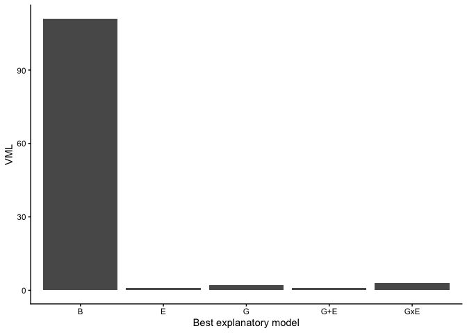

# RAMEN

## Overview

**Regional Association of Methylome variability with the Exposome and
geNome** **(RAMEN)** is an R package which goal is to estimate the
contribution of genetic variants and environmental exposures to loci
with high DNA methylation (DNAme) variability at a genome-wide scale
using population data. Characterizing the factors that contribute to
DNAme variability is important because DNAme is a key epigenetic
mechanism that regulates gene expression and plays an important role in
development, disease, and environmental adaptation.

RAMEN provides a Findable, Accesible, Interoperable and Reusable (FAIR)
workflow to conduct gene-environment contribution analyses to
high-dimensional DNA methylome data (described in [Navarro-Delgado et
al. (2025)](https://doi.org/10.1186/s13059-025-03864-4). Using a blend
of traditional statistical methods and machine learning approaches,
RAMEN is designed to be computationally efficient and user-friendly,
allowing researchers to gain insights into the complex interplay between
genetics, environment and DNA methylation variability. The package
includes a detailed
[tutorial](https://ericknavarrod.github.io/RAMEN/articles/RAMEN.html),
and individual functions that could be useful for other applications
beyond the gene-environment contribution analysis.

RAMEN takes advantage of the fact that DNA methylation levels at nearby
CpG sites are often correlated, and uses this information to identify
Variable Methylated Loci (VML) from microarray DNA methylation data.
Then, integrating genomic and exposomic data, it can identify which
model out of the following explains best the DNA methylation variability
at each VML: genetic (G), environmental (E), additive (G+E) or
interactive (GxE).

## Installation

You can install the latest version of RAMEN from
[GitHub](https://github.com/) with:

``` r

## Install dependencies
# install.packages("BiocManager")
# BiocManager::install("S4Vectors")
# BiocManager::install("IRanges")
# BiocManager::install("GenomicRanges")
## If using any of these Illumina microarrays, pick one: 
# BiocManager::install("IlluminaHumanMethylation450kanno.ilmn12.hg19")
# BiocManager::install("IlluminaHumanMethylationEPICanno.ilm10b4.hg19")
# BiocManager::install("IlluminaHumanMethylationEPICv2anno.20a1.hg38")

## Install the RAMEN package from GitHub
BiocManager::install("ErickNavarroD/RAMEN")
```

## Usage

For a detailed tutorial on how to use RAMEN, please check the package’s
vignette or
[website](https://ericknavarrod.github.io/RAMEN/articles/RAMEN.html).
Altogether, RAMEN provides a workflow that takes a set of individuals
with genome, exposome and DNA methylome information, and generates an
estimation of the contribution of genetic variants and environmental
exposures to its DNA methylation variability. Functions that conduct
computationally intensive tasks are compatible with parallel computing.


In brief, the standard workflow consists of the following steps:

1.  Identify Variable Methylated Loci (VML) with
    [`findVML()`](https://ericknavarrod.github.io/RAMEN/reference/findVML.md).

``` r

library(RAMEN)
#>          __      _             ___
#>          )_)    /_)    )\/)    )_     )\  )
#>         / \    / /    (  (    (__    (  \(
#> 
#>                   (   )  (  (
#>                  (  ( )  (  )
#>                    )    )  (
#>                 _.(--'(''--.._
#>                /, _..-----).._,\
#>               |  `'''-----'''`  |
#>                \               /
#>                 '.           .'
#>                   '--.....--'
#> 
#> If you use RAMEN for your analysis, please cite: Navarro-Delgado,
#> E.I., et al. RAMEN: Dissecting individual, additive and interactive
#> gene-environment contributions to DNA methylome variability in cord
#> blood. Genome Biol 26, 421 (2025).
library(dplyr)
#> 
#> Attaching package: 'dplyr'
#> The following objects are masked from 'package:stats':
#> 
#>     filter, lag
#> The following objects are masked from 'package:base':
#> 
#>     intersect, setdiff, setequal, union
library(ggplot2)
library(doParallel)
#> Loading required package: foreach
#> Loading required package: iterators
#> Loading required package: parallel

# Set the parallel backend to use 2 workers
doParallel::registerDoParallel(2)

VML <- RAMEN::findVML(
  methylation_data = RAMEN::test_methylation_data,
  array_manifest = "IlluminaHumanMethylationEPICv1",
  cor_threshold = 0,
  var_method = "variance",
  var_distribution = "ultrastable",
  var_threshold_percentile = 0.99,
  max_distance = 1000
)
#> Identifying Highly Variable Probes...
#> Setting options('download.file.method.GEOquery'='auto')
#> Setting options('GEOquery.inmemory.gpl'=FALSE)
#> Identifying sparse Variable Methylated Probes
#> Identifying Variable Methylated Regions...
#> Applying correlation filter to Variable Methylated Regions...

head(VML$VML) # Take a look at the identified VML GRanges object
#> GRanges object with 6 ranges and 5 metadata columns:
#>       seqnames            ranges strand |    n_VMPs                probes
#>          <Rle>         <IRanges>  <Rle> | <numeric>                <list>
#>   [1]    chr21 10990119-10990903      + |         2 cg09872009,cg05437132
#>   [2]    chr21 11109021-11109336      + |         2 cg00750806,cg12301579
#>   [3]    chr21 31799091-31799248      + |         2 cg24500711,cg07621949
#>   [4]    chr21 32715908-32716792      + |         2 cg16417027,cg14151498
#>   [5]    chr21 15955548-15955699      - |         2 cg14772146,cg07412745
#>   [6]    chr21 26573136-26573196      - |         2 cg11112002,cg23973918
#>       median_correlation        type   VML_index
#>                <numeric> <character> <character>
#>   [1]           0.609918         VMR        VML1
#>   [2]           0.626168         VMR        VML2
#>   [3]           0.727915         VMR        VML3
#>   [4]           0.693244         VMR        VML4
#>   [5]           0.812065         VMR        VML5
#>   [6]           0.617368         VMR        VML6
#>   -------
#>   seqinfo: 1 sequence from an unspecified genome; no seqlengths
```

2.  Summarize the regional methylation state of each VML with
    [`summarizeVML()`](https://ericknavarrod.github.io/RAMEN/reference/summarizeVML.md).

``` r

summarized_methyl_VML <- RAMEN::summarizeVML(
  VML = VML$VML,
  methylation_data = test_methylation_data
)

# Look at the resulting object
summarized_methyl_VML[1:5, 1:5]
#>         VML1     VML2     VML3     VML4     VML5
#> ID1 4.935942 2.853168 6.389600 9.017997 2.714379
#> ID2 1.879166 2.699689 7.790474 3.134218 2.223942
#> ID3 3.311818 1.078262 4.135771 2.864724 8.648046
#> ID4 6.558106 4.683173 6.153156 3.828411 1.448140
#> ID5 2.899969 4.930614 4.919235 3.664651 2.926548
```

3.  Identify the SNPs in *cis* of each VML with
    [`findCisSNPs()`](https://ericknavarrod.github.io/RAMEN/reference/findCisSNPs.md).

``` r

VML_cis_snps <- RAMEN::findCisSNPs(
  VML = VML$VML,
  genotype_information = RAMEN::test_genotype_information,
  distance = 1e+06
)
#> Reminder: please make sure that the positions of the VML data frame and the ones in the genotype information are from the same genome build.

# Take a look at the result
head(VML_cis_snps)
#> GRanges object with 6 ranges and 7 metadata columns:
#>       seqnames            ranges strand |    n_VMPs                probes
#>          <Rle>         <IRanges>  <Rle> | <numeric>                <list>
#>   [1]    chr21 10990119-10990903      + |         2 cg09872009,cg05437132
#>   [2]    chr21 11109021-11109336      + |         2 cg00750806,cg12301579
#>   [3]    chr21 31799091-31799248      + |         2 cg24500711,cg07621949
#>   [4]    chr21 32715908-32716792      + |         2 cg16417027,cg14151498
#>   [5]    chr21 15955548-15955699      - |         2 cg14772146,cg07412745
#>   [6]    chr21 26573136-26573196      - |         2 cg11112002,cg23973918
#>       median_correlation        type   VML_index surrounding_SNPs
#>                <numeric> <character> <character>        <integer>
#>   [1]           0.609918         VMR        VML1                1
#>   [2]           0.626168         VMR        VML2                1
#>   [3]           0.727915         VMR        VML3              659
#>   [4]           0.693244         VMR        VML4              855
#>   [5]           0.812065         VMR        VML5              726
#>   [6]           0.617368         VMR        VML6              788
#>                                                         SNP
#>                                                      <list>
#>   [1]                                       21:10873592:G:A
#>   [2]                                       21:10873592:G:A
#>   [3]   21:30813322:G:A,21:30860437:G:A,21:30862803:T:C,...
#>   [4] 21:31718195:C:T,21:31719083:AAG:A,21:31719372:C:T,...
#>   [5]   21:14957973:A:G,21:15167527:T:C,21:15169567:C:T,...
#>   [6]   21:25582143:A:G,21:25586702:G:A,21:25587960:G:T,...
#>   -------
#>   seqinfo: 1 sequence from an unspecified genome; no seqlengths
```

4.  Conduct a LASSO-based feature selection strategy to identify
    potentially relevant *cis* SNPs and environmental variables with
    [`selectVariables()`](https://ericknavarrod.github.io/RAMEN/reference/selectVariables.md).

``` r

selected_variables <- RAMEN::selectVariables(
  VML_wSNPs = VML_cis_snps,
  genotype_matrix = RAMEN::test_genotype_matrix,
  environmental_matrix = RAMEN::test_environmental_matrix,
  covariates = RAMEN::test_covariates,
  summarized_methyl_VML = summarized_methyl_VML,
  seed = 1
)
#> Loading required package: rngtools

head(selected_variables)
#>   VML_index selected_genot selected_env
#> 1      VML1   21:10873.... E43, E3,....
#> 2      VML2   21:10873....          E43
#> 3      VML3   21:32782.... E15, E25....
#> 4      VML4                         E43
#> 5      VML5   21:15248....     E40, E43
#> 6      VML6   21:25648....          E43
```

5.  Fit linear single-variable genetic (G), environmental (E), pairwise
    additive (G+E) and pairwise interaction (GxE) linear models, and
    select the best explanatory model for each VML with
    [`lmGE()`](https://ericknavarrod.github.io/RAMEN/reference/lmGE.md).

``` r

lmge_res <- RAMEN::lmGE(
  selected_variables = selected_variables,
  summarized_methyl_VML = summarized_methyl_VML,
  genotype_matrix = RAMEN::test_genotype_matrix,
  environmental_matrix = RAMEN::test_environmental_matrix,
  covariates = RAMEN::test_covariates,
  model_selection = "AIC"
)

# Check the output
head(lmge_res)
#> # A tibble: 6 × 13
#>   VML_index model_group variables tot_r_squared g_r_squared e_r_squared
#>   <chr>     <chr>       <list>            <dbl>       <dbl>       <dbl>
#> 1 VML1      G+E         <chr [2]>         0.553       0.200       0.342
#> 2 VML2      G+E         <chr [2]>         0.512       0.210       0.271
#> 3 VML3      GxE         <chr [2]>         0.568       0.272       0.204
#> 4 VML4      E           <chr [1]>         0.301      NA           0.228
#> 5 VML5      G+E         <chr [2]>         0.755       0.425       0.223
#> 6 VML6      G+E         <chr [2]>         0.589       0.232       0.199
#> # ℹ 7 more variables: gxe_r_squared <dbl>, AIC <dbl>, second_winner <chr>,
#> #   delta_aic <dbl>, delta_r_squared <dbl>, basal_AIC <dbl>,
#> #   basal_rsquared <dbl>
```

6.  Simulate a null distribution of G and E effects on DNAme variability
    with
    [`nullDistGE()`](https://ericknavarrod.github.io/RAMEN/reference/nullDistGE.md),
    and use it to filter out poor-performing best explanatory models
    selected by *lmGE()*.

``` r

null_dist <- RAMEN::nullDistGE(
  VML_wSNPs = VML_cis_snps,
  genotype_matrix = RAMEN::test_genotype_matrix,
  environmental_matrix = RAMEN::test_environmental_matrix,
  summarized_methyl_VML = summarized_methyl_VML,
  permutations = 1,
  covariates = RAMEN::test_covariates,
  seed = 1,
  model_selection = "AIC"
)
#> Starting permutation 1 of 1
#> Starting variable selection of permutation 1 of 1
#> Starting lmGE in permutation 1 of 1
#> Wrapping up permutation 1 of 1

# Set threshold
cutoff_single <- quantile(
  null_dist %>%
    filter(model_group %in% c("G", "E")) %>%
    pull(R2_difference),
  0.95
)
cutoff_joint <- quantile(
  null_dist %>%
    filter(model_group %in% c("G+E", "GxE")) %>%
    pull(R2_difference),
  0.95
)

# Get a data frame with the final results
final_res <- lmge_res %>%
  dplyr::mutate(
    r2_difference_basal = tot_r_squared - basal_rsquared,
    # Label if the best explanatory model passes its corresponding threshold
    pass_cutoff_threshold = case_when(
      model_group %in% c("G", "E") ~ r2_difference_basal > cutoff_single,
      model_group %in% c("G+E", "GxE") ~ r2_difference_basal > cutoff_joint
    ),
    # Label the final model group, replacing bad performing winning models with
    #  "B" (basal)
    model_group = case_when(
      pass_cutoff_threshold ~ model_group,
      TRUE ~ "B"
    )
  ) %>%
  dplyr::select(-pass_cutoff_threshold) # Drop temporary column

# Keep only VML that have informative models with out data
filtered_res <- final_res %>%
  dplyr::filter(!model_group == "B") # Filter based on the cutoff threshold

final_res %>%
  dplyr::group_by(model_group) %>%
  dplyr::summarise(count = n()) %>%
  ggplot2::ggplot(aes(x = model_group, y = count)) +
  ggplot2::geom_col() +
  ggplot2::xlab("Best explanatory model") +
  ggplot2::ylab("VML") +
  ggplot2::theme_classic()
```



It is worth mentioning that RAMEN assumes that all data sets (genome,
exposome and methylome) have undergone quality control, pre-processing
and normalization steps when required. The choice of methods for these
steps are out of the scope of this package, but we provide some
resources and guidance in the
[tutorial](https://ericknavarrod.github.io/RAMEN/articles/RAMEN.html).

## Variations to the standard workflow

Besides using RAMEN for a gene-environment contribution analysis, the
package provides individual functions that could help users in other
tasks, such as:

- Reduction of multiple hypothesis test burden in EWAS or differential
  methylation analysis by using VML instead of individual probes.
- Fit additive and interaction models given a set of variables of
  interest and select the best explanatory model for DNAme data
  (e.g. epistasis or ExE studies).
- Quickly identify SNPs in *cis* of CpG probes.
- Get the median correlation of probes in custom regions of interest
  with
  [`medCorVMR()`](https://ericknavarrod.github.io/RAMEN/reference/medCorVMR.md).

## How to get help for RAMEN

If you have any question about RAMEN usage, please [post a new
issue](https://github.com/ErickNavarroD/RAMEN/issues/new/choose) in this
github repository so that future users also benefit from the discussion.

## Acknowledgments

This package was developed by Erick I. Navarro-Delgado under the
supervision of Dr. Keegan Korthauer and Dr. Michael S. Kobor. We want to
thank the members of the Kobor and Korthauer lab for their feeback
during the development of RAMEN. Additionally, we want to thank Carlos
Cortés-Quiñones and Dorothy Lin for helping create the package logo.
Erick conceptualized the logo, Carlos drew it, and Dorothy refined it
and finished the lettering.

## Funding

This work was supported by the University of British Columbia, the BC
Children’s Hospital Research Institute and the Social Exposome Cluster.

## Citing RAMEN

If you use RAMEN for any of your analyses, please cite the following
publication:

- Navarro-Delgado, E.I., Czamara, D., Edwards, K. et al. RAMEN:
  Dissecting individual, additive and interactive gene-environment
  contributions to DNA methylome variability in cord blood. *Genome
  Biol* 26, 421 (2025). <https://doi.org/10.1186/s13059-025-03864-4>

## Code of conduct

Please note that this package is released with a [Contributor Code of
Conduct](https://ropensci.org/code-of-conduct/). By contributing to this
project, you agree to abide by its terms.

## Licence

GPL (\>= 3)
